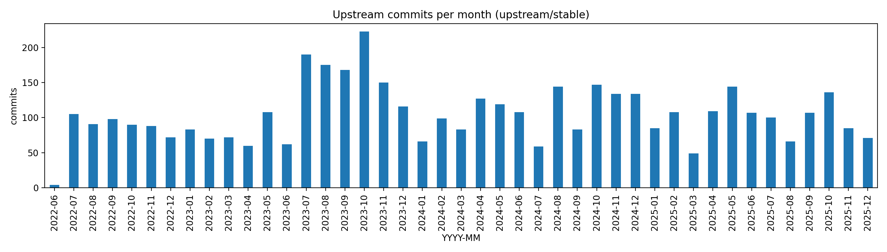
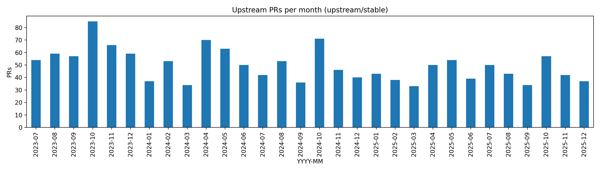
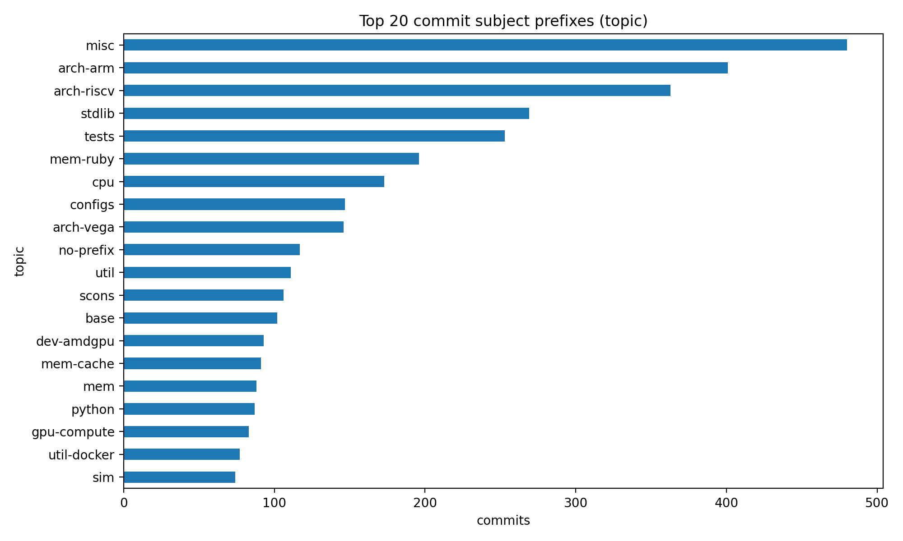
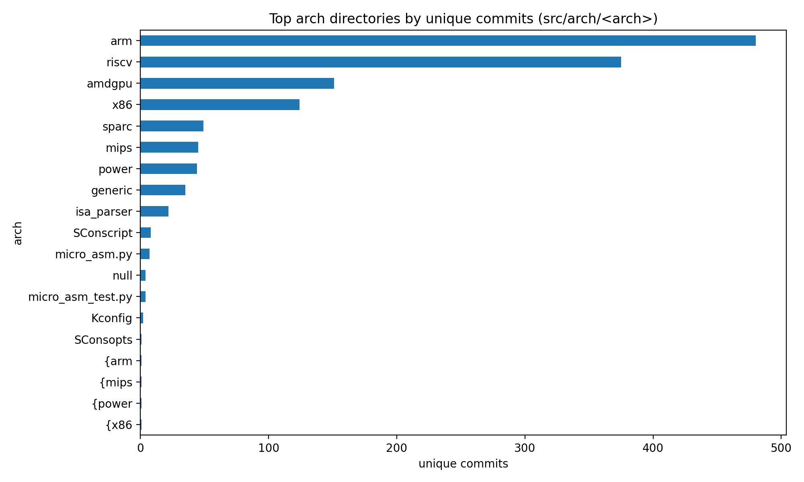
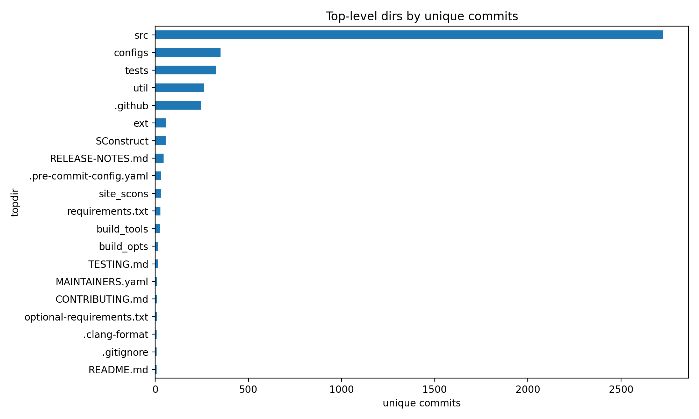

# upstream 变更（人类友好版入口）

## 你应该先看什么

- 版本级总结（按 release tag）：`releases_zh.md`
- PR 级总结（按 release tag）：`prs_by_release_zh.md`
- PR 一句话摘要（按 release tag）：`prs_one_liner_by_release_zh.md`
- PR 逐条 digest：`prs_detailed_zh.md`
- 重点目录聚合：`focus_subsystems_zh.md`
- commit 逐条 digest：`commits_detailed_zh.md`

## 一句话结论

- 从 `v22.0.0.1` 到 `v25.1.0.0`，upstream 主要在 **Arm/RISC-V ISA**、**标准库/配置脚本**、**Ruby/内存系统**、以及 **CI/工程化** 上持续迭代；累计 4495 commits（可识别 PR 1495 个）。

## 统计速览

- commits: 4495（merge: 598）
- PR（可识别）: 1495
- author 去重: 229
- 与 `origin/xs-dev` 对比：origin-only=1889, upstream-only=4495

## 可视化

