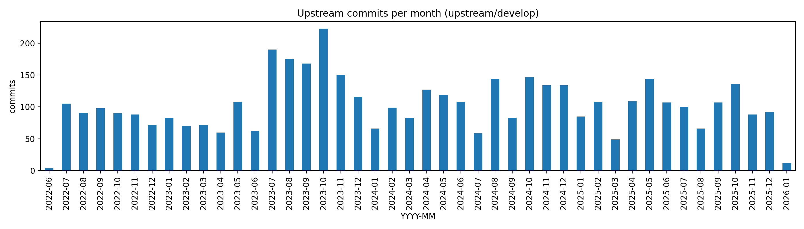
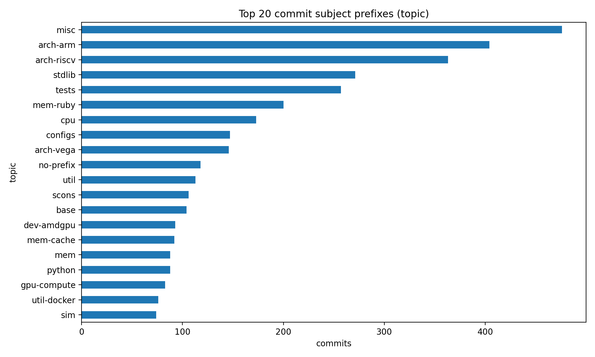
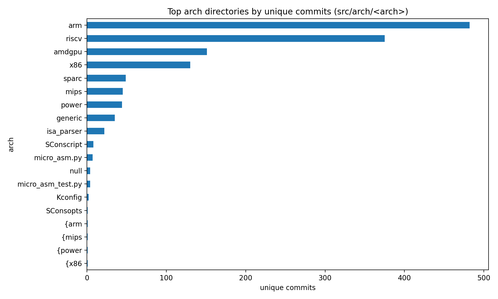
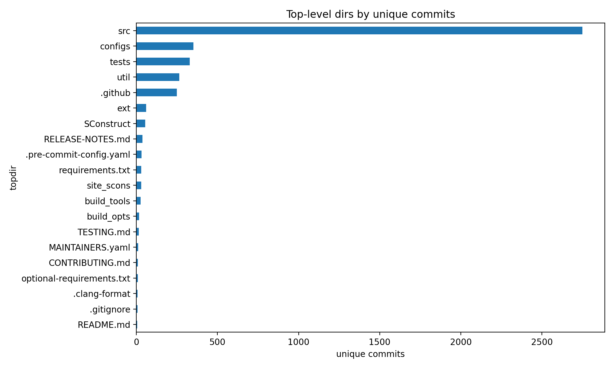

# Upstream Changes Since Fork Point

## Baseline

- origin ref: `origin/xs-dev` = `af4104453e2072d322f9061751d6149dbeca1b9a`
- upstream ref: `upstream/develop` = `eb344eb5ee91e86b9fa0358e653d3b4c738f3b4e`
- fork/base (merge-base): `a3be84cb1b854da51716d6399ca139016714bd54`
- base tag: `v22.0.0.1`
- upstream nearest tag: `v25.0.0.1`

## Stats

- commits in range `a3be84cb1b854da51716d6399ca139016714bd54..upstream/develop`: **4531** (merge commits: 604)
- time span: `2022-06-29T12:40:28+00:00` -> `2026-01-16T11:08:25-08:00`
- unique authors: 231
- symmetric diff vs `origin/xs-dev`: origin-only=1889, upstream-only=4531

## Release tags in range

| tag | date | commit | subject |
|---|---|---|---|
| `v22.0.0.1` | 2022-06-18 | `39f85b7a3be1` | misc: Update version info to v22.0.0.1 |
| `v22.0.0.2` | 2022-07-27 | `1d03f6de9415` | misc: Update RELEASE-NOTES.md for v22.0.0.2 |
| `v22.1` | 2022-12-30 | `5fa484e2e026` | misc: Merge the v22.1 release staging into stable |
| `v22.1.0.0` | 2022-12-30 | `5fa484e2e026` | misc: Merge the v22.1 release staging into stable |
| `v23.0` | 2023-08-11 | `6835f0665744` | misc: Minor release v23.0.1.0 (#174) |
| `v23.0.0.0` | 2023-07-07 | `1db206b9d371` | misc: Merge branch 'release-staging-v23-0' into stable |
| `v23.0.0.1` | 2023-07-10 | `af72b9ba5805` | misc: Update RELEASE-NOTES.md for v23.0.0.1 hotfix |
| `v23.0.1.0` | 2023-08-11 | `6835f0665744` | misc: Minor release v23.0.1.0 (#174) |
| `v23.1` | 2023-12-28 | `bae34876780d` | misc: Merge `release-staging-v23-1` into `stable` (#711) |
| `v23.1.0.0` | 2023-12-28 | `bae34876780d` | misc: Merge `release-staging-v23-1` into `stable` (#711) |
| `v24.0` | 2024-08-08 | `b1a44b89c7ba` | misc: v24.0.0.1 Hotfix release (#1425) |
| `v24.0.0.0` | 2024-06-27 | `43769abaf051` | misc: Merge v24.0 release staging branch to stable (#1274) |
| `v24.0.0.1` | 2024-08-08 | `b1a44b89c7ba` | misc: v24.0.0.1 Hotfix release (#1425) |
| `v24.1` | 2025-04-11 | `b9da2bfe1e21` | misc: Hotfix v24.1.0.3 (#2177) |
| `v24.1.0.0` | 2024-12-07 | `63d25922a2db` | tests: Update pyunit tests references to include 24.1 (#1843) |
| `v24.1.0.1` | 2024-12-19 | `c9625ce9cc5b` | v24.1.0.1 Hotfix Release  (#1875) |
| `v24.1.0.2` | 2025-02-12 | `186a913a48f1` | misc: Hotfix v24.1.0.2 (#1964) |
| `v24.1.0.3` | 2025-04-11 | `b9da2bfe1e21` | misc: Hotfix v24.1.0.3 (#2177) |
| `v25.0` | 2025-08-11 | `ddd4ae35adb0` | misc: Hotfix 25.0.0.1 (#2496) |
| `v25.0.0.0` | 2025-06-18 | `d22064c1c05f` | misc: Release v25.0.0.0 (#2322) |
| `v25.0.0.1` | 2025-08-11 | `ddd4ae35adb0` | misc: Hotfix 25.0.0.1 (#2496) |

## Top topics (commit subject prefixes)

| topic | commits |
|---|---:|
| `misc` | 476 |
| `arch-arm` | 404 |
| `arch-riscv` | 363 |
| `stdlib` | 271 |
| `tests` | 257 |
| `mem-ruby` | 200 |
| `cpu` | 173 |
| `configs` | 147 |
| `arch-vega` | 146 |
| `no-prefix` | 118 |
| `util` | 113 |
| `scons` | 106 |
| `base` | 104 |
| `dev-amdgpu` | 93 |
| `mem-cache` | 92 |

## Top directories (unique commits)

| dir | unique commits |
|---|---:|
| `src` | 2750 |
| `configs` | 351 |
| `tests` | 328 |
| `util` | 265 |
| `.github` | 250 |
| `ext` | 60 |
| `SConstruct` | 55 |
| `RELEASE-NOTES.md` | 38 |
| `.pre-commit-config.yaml` | 32 |
| `requirements.txt` | 30 |
| `site_scons` | 29 |
| `build_tools` | 26 |
| `build_opts` | 17 |
| `TESTING.md` | 15 |
| `MAINTAINERS.yaml` | 10 |

## Top subsystems (unique commits)

| subsystem | unique commits |
|---|---:|
| `arch` | 1080 |
| `python` | 512 |
| `configs` | 351 |
| `mem` | 342 |
| `tests` | 328 |
| `util` | 265 |
| `.github` | 250 |
| `dev` | 230 |
| `cpu` | 200 |
| `base` | 174 |
| `src` | 156 |
| `sim` | 149 |
| `cpu/o3` | 133 |
| `gpu-compute` | 89 |
| `cpu/simple` | 75 |

## Top arch directories (unique commits under src/arch/<arch>)

| arch | unique commits |
|---|---:|
| `arm` | 482 |
| `riscv` | 375 |
| `amdgpu` | 151 |
| `x86` | 130 |
| `sparc` | 49 |
| `mips` | 45 |
| `power` | 44 |
| `generic` | 35 |
| `isa_parser` | 22 |
| `SConscript` | 8 |
| `micro_asm.py` | 7 |
| `null` | 4 |
| `micro_asm_test.py` | 4 |
| `Kconfig` | 2 |
| `SConsopts` | 1 |

## Visualizations









## Release Major Highlights (from RELEASE-NOTES.md)

### Version 25.0

- Hypercalls and New Exit Event Handlers
- Improved RISC-V and Arm ISA Support
- Python Utilities
- OptionalParam and DictParam

## Detailed per-commit list

- `commits.md`: one-line explanation per commit (chronological)
- `commits_detailed_zh.md`: per-commit detailed digest (Chinese)
- `data/commits.csv`: commit metadata + aggregated numstat
- `data/files.csv`: per-file numstat (may be large)

## Reproduce

```bash
python3 /nfs/home/lixin/myworkspace/simulator/perf/1212_cdp_perf/GEM5/.codex/reports/upstream_since_fork_a3be84c_develop/scripts/generate_upstream_report.py \
  --origin-ref origin/xs-dev --upstream-ref upstream/develop --base a3be84cb1b854da51716d6399ca139016714bd54 \
  --outdir /nfs/home/lixin/myworkspace/simulator/perf/1212_cdp_perf/GEM5/.codex/reports/upstream_since_fork_a3be84c_develop
```
