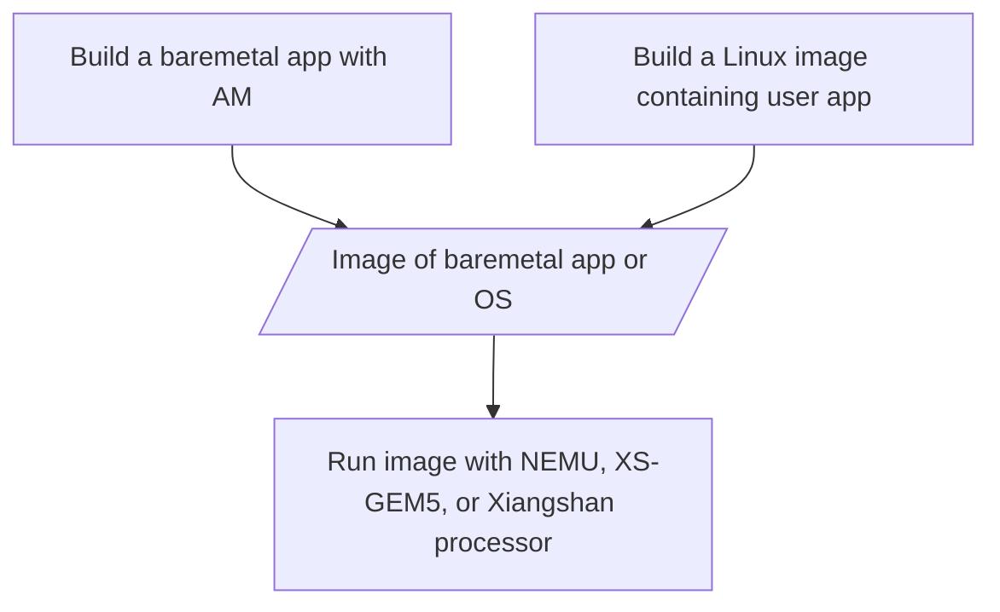
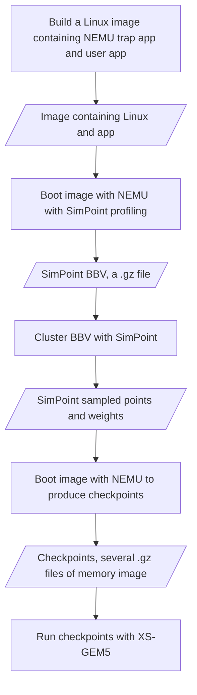
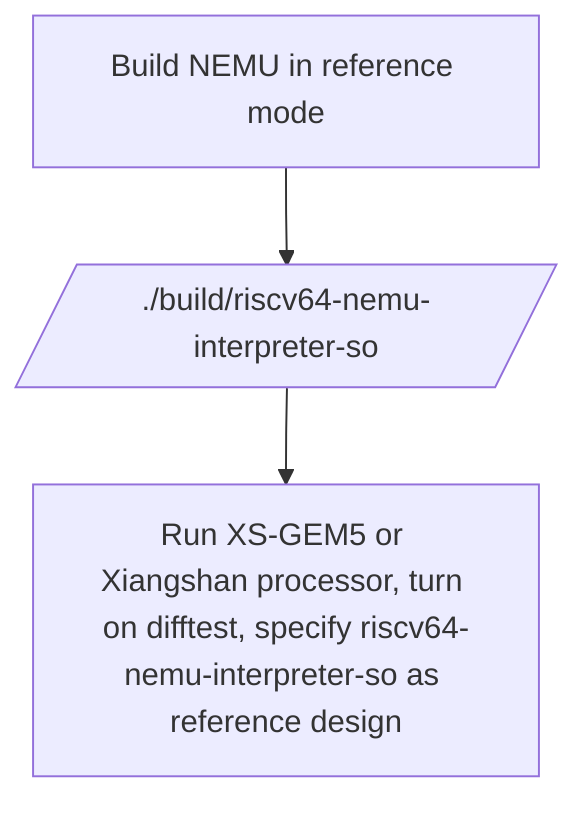

# About

This is the gem5 simulator for Xiangshan (XS-GEM5), which currently scores similar with Nanhu on SPEC CPU 2006.

## Features

XS-GEM5 is not as easy to use as official GEM5, because it only supports full-system simulation
with Xiangshan's specific formats, refer to [Workflows](#workflows-how-to-run-workloads) for more details.

XS-GEM5 is enhanced with
- Xiangshan RVGCpt: a cross-platform full-system checkpoint for RISC-V.
- Xiangshan online Difftest: an API to check execution results online.
- Frontend microarchitecture calibrated with Xiangshan V2 (Nanhu): Decoupled frontend, TAGESC, and ITTAGE,
which performance better than LTAGE and TAGE-SCL shipped in official version on SPECCPU.
- Instruction latency calibrated with Nanhu
- Cache hierarchy, latency, and prefetchers calibrated with Nanhu.
- A fixed Multi-Prefetcher framework with VA-PA translation support
- A fixed BOP prefetcher
- Parallel RV PTW (Page Table Walker) and walking state coalescing
- Cascaded FMA
- Move elimination
- L2 TLB and TLB prefetching (coming soon).
- Other functional or performance bug fixes.

## Branches

Because XS-GEM5 is currently under internal development, we have several branches for different purposes:
- xs-dev branch is periodically synced with our internal development branch.
- backport branch is used to backport patches that affects functional correctness and basic usage.

## What is NOT supported

- Cannot run Boom's baremetal app
  * We only support [Abstract Machine](https://github.com/OpenXiangShan/nexus-am) baremetal environment or Linux for Xiangshan.
- Cannot directly run an ELF
  * GEM5's System call emulation is not supported.([What is system call emulation](https://stackoverflow.com/questions/48986597/when-to-use-full-system-fs-vs-syscall-emulation-se-with-userland-programs-in-gem))
  * QEMU's User space emulation is not supported.([What is user space emulation](https://www.qemu.org/docs/master/user/main.html))
- Checkpoint is not compatible with GEM5's SE checkpoints or m5 checkpoints.
  * Cannot produce GEM5's SE checkpoints or m5 checkpoints
  * Cannot run GEM5's SE checkpoints or m5 checkpoints
- Recommend NOT to produce a checkpoint in M-mode

## Please DO NOT

- Please don't make a new issue without reading the doc
- Please don't make a new issue without searching in issue list
- Please don't running boom's baremetal app with XS-GEM5
- Please don't running SimPoint bbv.gz with NEMU, XS-GEM5, or Xiangshan processor, because it is not bootable
- Please don't make a new issue about building Linux in NEMU's issue list,
plz head to [Xiangshan doc](https://github.com/OpenXiangShan/XiangShan-doc/issues?q=is%3Aissue)

## Maintainers will BLOCK you from this repo if

- Try to run boom's baremetal app with XS-GEM5, and make a related issue
- Try to run SimPoint bbv.gz with XS-GEM5, and make a related issue

# A Short Doc

## Workflows: How to run workloads

### Run without checkpoint

The typical flow for running workloads is similar for [NEMU](https://github.com/OpenXiangShan/NEMU/),
[XS-GEM5](https://github.com/OpenXiangShan/GEM5),
and [Xiangshan processor](https://github.com/OpenXiangShan/XiangShan).
All of them only support full-system simulation.
To prepare workloads for full-system simulation, users need to either build a baremetal app or
running user programs in an operating system.



### Run in with checkpoints

Because most of the enterprise users and researchers are more interested in running larger workloads,
like SPECCPU, on XS-GEM5.
To reduce the simulation time of detailed simulation, NEMU serves as a checkpoint producer.
The flow for producing and running checkpoints is as follows.



### How to prepare workloads

As described above, XS-GEM5 either takes a baremetal app or a checkpoint as input.

To build baremetal app compatible with XS-GEM5,
we use [Abstract Machine](https://github.com/OpenXiangShan/nexus-am) as a light-weight baremetal library.
Common simple apps like coremark and dhrystone can be built with Abstract Machine.

To obtain checkpoints of large applications,
please follow [the doc to build Linux](https://xiangshan-doc.readthedocs.io/zh-cn/latest/tools/linux-kernel-for-xs/)
to pack a image,
and follow [the checkpoint tutorial for Xiangshan](https://xiangshan-doc.readthedocs.io/zh_CN/latest/tools/simpoint/)
to produce checkpoints.

The process to produce SimPoint checkpoints includes ***3 individual steps***
1. SimPoint Profiling to get BBVs. (To save space, they often output in compressed formats such as **bbv.gz**.)
1. SimPoint clustering. You can also opt to Python and sk-learn to do k-means clustering. (In this step, what is typically obtained are the **positions** selected by SimPoint and their **weights**.)
1. Taking checkpoints according to clustering results. (In the RVGCpt process, this step generates the **checkpoints** that will be used for simulation.)

If you have problem generating SPECCPU checkpoints, following links might help you.
- [The video to build SPECCPU, put it in Linux, and run it in NEMU to get SimPoint BBVs](https://drive.google.com/file/d/1msr_YijlYN4rxpn71bod1LAoRWs5VtAL/view?usp=sharing) (step 1)
- [The document to do SimPoint clustering based on BBVs and take simpoint checkpoints](https://zhuanlan.zhihu.com/p/604396330) (step 2 & 3)

## Basic build environment

Install dependencies as [official GEM5 tutorial](https://www.gem5.org/documentation/general_docs/building) says:

### Setup on Ubuntu 22.04
If compiling gem5 on Ubuntu 22.04, or related Linux distributions, you may install all these dependencies using APT:

``` shell
sudo apt install build-essential git m4 scons zlib1g zlib1g-dev \
    libprotobuf-dev protobuf-compiler libprotoc-dev libgoogle-perftools-dev \
    python3-dev libboost-all-dev pkg-config libsqlite3-dev
```

### Setup on Ubuntu 20.04
If compiling gem5 on Ubuntu 20.04, or related Linux distributions, you may install all these dependencies using APT:

``` shell
sudo apt install build-essential git m4 scons zlib1g zlib1g-dev \
    libprotobuf-dev protobuf-compiler libprotoc-dev libgoogle-perftools-dev \
    python3-dev python-is-python3 libboost-all-dev pkg-config libsqlite3-dev
```

### Setup on Ubuntu 18.04
If compiling gem5 on Ubuntu 18.04, or related Linux distributions, you may install all these dependencies using APT:

``` shell
sudo apt install build-essential git m4 scons zlib1g zlib1g-dev \
    libprotobuf-dev protobuf-compiler libprotoc-dev libgoogle-perftools-dev \
    python3-dev python libboost-all-dev pkg-config libsqlite3-dev
```


## Clone and build DRAMSim3

Refer to [The readme for DRAMSim3](ext/dramsim3/README) to install DRAMSim3.

Notes:
- If you have already built GEM5, you should rebuild gem5 after install DRAMSim3
- If simulating Xiangshan system, use DRAMSim3 with our costumized config

Usage:

``` shell
$gem5_home/build/gem5.opt ... fs.py ... \
    --mem-type=DRAMsim3 \
    --dramsim3-ini=$gem5_home/ext/dramsim3/xiangshan_configs/xiangshan_DDR4_8Gb_x8_3200_2ch.ini ...
```

## Build GEM5

```shell
cd GEM5
scons build/RISCV/gem5.opt --gold-linker -j8
export gem5_home=`pwd`
```

Press enter if you saw
```
You're missing the gem5 style or commit message hook. These hooks help
to ensure that your code follows gem5's style rules on git commit.
This script will now install the hook in your .git/hooks/ directory.
Press enter to continue, or ctrl-c to abort:
```

## Run Gem5

Users must properly prepare workloads before running GEM5, plz read [Workflows](#workflows-how-to-run-workloads) first.

[The example running script](util/warmup_scripts/simple_gem5.sh) contains the default configuration for XS-GEM5,
and a simple batch running function.

**NOTE**: If you want to cosimulate against NEMU, please refer to [Difftest with NEMU](#difftest-with-nemu) before running,
and set NEUM_HOME to the root directory of NEMU.
If not, please delete the line containing `--enable-difftest \` in the example running script.


[The example running script](util/warmup_scripts/simple_gem5.sh) runs GEM5 with single thread (`function single_run`) or multiple threads (`function parallel_run`).
Both `single_run` and `parallel_run` calls `function run`.
`function run` provides the default parameters for XS-GEM5.

For debugging or performance tuning, we usually call `single_run` and modify parameters for `function run`.
`run` takes 5 parameters:
- `debug_gz`: the path to the debug binary (usually checkpoint) of the program to run.
- `warmup_inst`: the number of instructions to warmup the cache, usually 20M.
- `max_inst`: the number of instructions to run, usually 40M. The first half is used for warmup, and the second half is used for statistics collection.
- `work_dir`: the directory to store the output files.
- the last parameter: whether enable Arch DB. Arch DB is a database to store the micro-architectural trace of the program. It is used for debugging and performance tuning.

More details can be found in comments and code of the example running script.

## Play with Arch DB

Arch DB is a database to store the micro-architectural trace of the program with SQLite.
You can access it with Python or other languages.
A Python example is given [here](util/arch_db/mem_trace.py).

## Difftest with NEMU

NEMU is used as a reference design for XS-GEM5.
Typical workflow is as follows.




We the [gem5-ref-main branch of NEMU](https://github.com/OpenXiangShan/NEMU/tree/gem5-ref-main) for difftest with XS-GEM5.

``` shell
git clone https://github.com/OpenXiangShan/NEMU.git -b gem5-ref-main
cd NEMU
export NEMU_HOME=`pwd`
make riscv64-nohype-ref_defconfig
make menuconfig  # then save configs
make -j 10
```

Then the contents of `build` directory should be 
```
build
|-- obj-riscv64-nemu-interpreter-so
|   `-- src
`-- riscv64-nemu-interpreter-so
```

then use `riscv64-nemu-interpreter-so` as reference for GEM5,
``` shell
export ref_so=`realpath build/riscv64-nemu-interpreter-so`

# This is not full command, but a piece of example.
$gem5_home/build/gem5.opt ... --enable-difftest --difftest-ref-so $ref_so ...
```

# FAQ

## Python problems

If your machine has a Python with very high version, you may need to install a lower version of Python
to avoid some compatibility issues. We recommend to use miniconda to install Python 3.8.

Installation command, copied from official [miniconda website](https://docs.conda.io/projects/miniconda/en/latest/)

``` shell
mkdir -p ~/miniconda3
wget https://repo.anaconda.com/miniconda/Miniconda3-latest-Linux-x86_64.sh -O ~/miniconda3/miniconda.sh
bash ~/miniconda3/miniconda.sh -b -u -p ~/miniconda3
rm -rf ~/miniconda3/miniconda.sh
```

Then add conda to path in `~/.bashrc` or `~/.zshrc`. Note this will hide the system Python.

``` shell
# for bash
~/miniconda3/bin/conda init bash
# for zsh
~/miniconda3/bin/conda init zsh
```
Restart your terminal, and you should be able to use conda. Then create a Python 3.8 env:

``` shell
# create env
conda create --name py38 --file $gem5_home/ext/xs_env/gem5-py38.txt

# This is mudatory to avoid conda auto activate base env
conda config --set auto_activate_base false
```

Each time login, you need to activate the conda env before building GEM5:

``` shell
conda activate py38
```

In case that you don't like this or it causes problem, to completely remove Python and conda from your PATH, run:

``` shell
# for bash
conda init bash --reverse
# for zsh
conda init zsh --reverse
```


## It complains `Python not found`

This is often not Python missing, but other problems.
Because the build scripts (and scons) uses a strange way to find Python, see `site_scons/gem5_scons/configure.py` for more detail.
For example, when building with clang10, I encountered this problem:

```
Error: Check failed for Python.h header.
        Two possible reasons:
       1. Python headers are not installed (You can install the package python-dev on Ubuntu and RedHat)
       2. SCons is using a wrong C compiler. This can happen if CC has the wrong value.
       CC = clang
```

This is not becaues of Python, but because GCC and clang have different warning suppression flags.
To fix it, I apply this path:

``` shell
git apply ext/xs_env/clang-warning-suppress.patch
```

But Python complaints are also possible caused by other problems,
For similar errors, check `build/RISCV/gem5.build/scons_config.log` to get the real error message.


# Original README

The README for official GEM5 is here: [Original README](./official-README.md)
