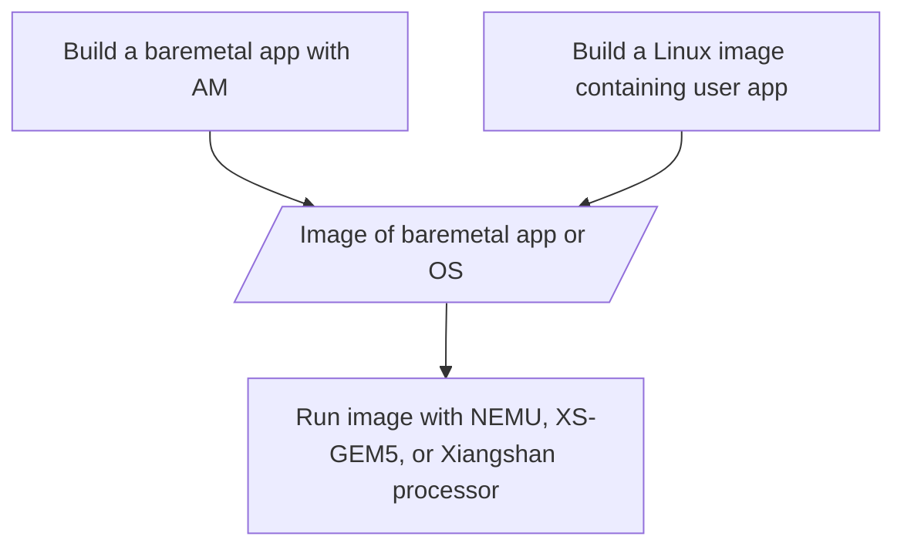
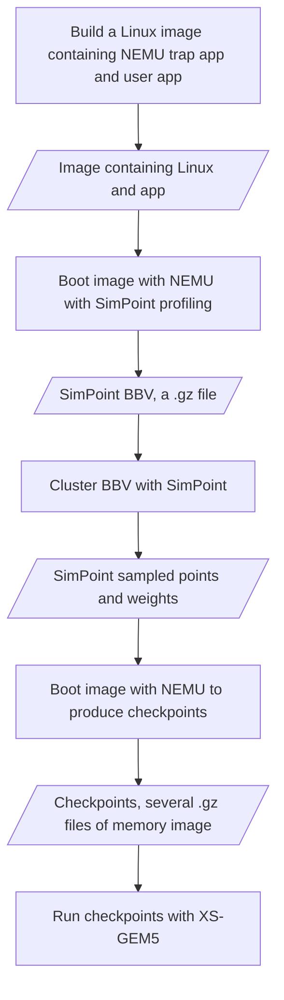
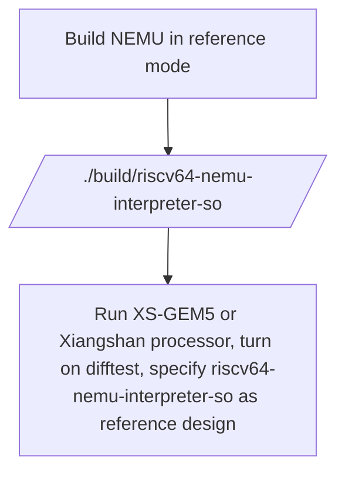

# About

Documentation website: https://xs-gem5.readthedocs.io/zh-cn/latest/

Design-doc entry: [docs/design-docs/README.md](docs/design-docs/README.md)

XS-GEM5 is a gem5-based, full-system RISC-V simulator for XiangShan.

XS-GEM5 is the ONLY open-source RISC-V simulator strictly calibrated against high-performance RTL (XiangShan Nanhu/Kunminghu), achieving >95% correlation on SPECCPU 2006.

In our current SPECCPU06 checkpoint evaluation:
- `idealkmhv3.py` exceeds 20 points/GHz, making XS-GEM5 one of the highest-performance open-source simulators.
- `kmhv3.py`, the RTL-aligned configuration, exceeds 15 points/GHz.
- We are co-developing with the XiangShan RTL team to push Kunminghu-v3 RTL towards 20 points/GHz as soon as possible.

XS-GEM5 diverged from [upstream gem5](https://github.com/gem5/gem5) in June 2022. Since XS-GEM5 focuses on cycle-accurate alignment with the XiangShan RTL, it is often difficult to upstream changes directly. We will keep actively merging new features from upstream gem5, and we also aim to contribute XS-GEM5 features back to upstream when possible. Contributions and collaboration from developers are welcome.

Our Chinese website is [here](https://xs-gem5.readthedocs.io/zh-cn/latest/), welcome to visit!

## Architecture Notes

For a high-level map of the repository, see [ARCHITECTURE.md](ARCHITECTURE.md).
It focuses on the XiangShan-aligned O3 CPU, the decoupled frontend, and the configuration/code boundaries that matter most for current development.

For design-oriented notes, see [docs/design-docs/README.md](docs/design-docs/README.md).
The index covers the Kunminghu v3 frontend/BPU and the XS-GEM5 SMT design.

## Thanks

In the development of the Kunming Lake v3 performance model, developers Zhang Qianlong, Zhang Lutong, Hu Kai, Yan Yuwei, Liu Shuquan, and Chen Dewei from Tencent Penglai Laboratory jointly made the following contributions:

1. Contributed and debugged the MGSC predictor model, which reduced MPKI by approximately 10% and improved overall performance by 0.3-0.4 points/GHz in the SpecInt 2006 checkpoint tests.

2. Contributed and debugged the L2 Next Prefetcher model, which improved MCF performance by approximately 23% and overall performance by 1.7% in the SpecInt 2006 checkpoint tests.

3. Contributed the model codes for the L2 Adjacent Block Prefetcher and Sector Cache.

We are grateful for their contributions and hope to continue to work together to improve the performance of XS-GEM5.

## Features

XS-GEM5 is not as easy to use as official GEM5, because it only supports full-system simulation
with Xiangshan's specific formats, refer to [Workflows](#workflows-how-to-run-workloads) for more details.

XS-GEM5 is enhanced with
- Xiangshan RVGCpt: a cross-platform full-system checkpoint for RISC-V.
- Xiangshan online Difftest: an API to check execution results online.
- Topdown performance counters
- Frontend microarchitecture calibrated with Xiangshan V3 (Kunminghu)
  * Decoupled frontend
  * TAGESC, ITTAGE, and optinal Loop predictor (performs better than LTAGE and TAGE-SCL shipped in official version on SPECCPU)
  * Instruction latency calibrated with Kunminghu
- Backend microarchitecture calibrated with Xiangshan V3 (Kunminghu)
  * Distributed scheduler
  * Scheduling/execution latency calibrated with Kunminghu
  * RVV mostly calibrated
- Cache hierarchy, latency, and prefetchers calibrated with Kunminghu.
  * Algorithm: Stream + Berti/Stride + BOP + SMS + Temporal + CDP
  * Framework: Active/Passive offloading; Multi-Prefetcher coordination
  * VA-PA translation support for all prefetchers
- Parallel RV PTW (Page Table Walker)
  * Walking state coalescing
  * PTW and TLBs for RV-H
- Cascaded FMA
- Move elimination
- L2 TLB and TLB prefetching.
- CSR fixes
- Other functional or performance bug fixes.

## Kunminghu configuration variants and CI coverage

We maintain three main Kunminghu configuration scripts to mirror RTL progress and performance targets. Each is covered by a distinct CI workflow so their results are easy to track (SPECCPU06 coverage shown in parentheses).

- `configs/example/kmhv2.py`: Kunminghu V2 baseline; used by the Tier 2 post-merge regression workflow `gem5 Performance Test (Tier 2 - Post-Merge)` (gcc12-spec06-0.8c). If further development under the kmh-v2–related configuration is required, please switch to the KMH-V2-CONFIG branch.
- `configs/example/kmhv3.py`: Kunminghu V3 RTL-aligned mainline; keeps some BPU/backend/performance knobs conservative to match the in-progress RTL, so scores are currently close to V2. CI: `gem5 Align BTB Performance Test(0.3c)` (gcc12-spec06-0.3c).
- `configs/example/idealkmhv3.py`: Ideal/performance-tuned V3 with aggressive microarchitectural settings enabled; currently the highest-scoring variant. CI: `gem5 Ideal BTB Performance Test` (gcc12-spec06-0.8c).

Note: 
- The V3 RTL BPU predictor and backend updates are still being implemented. Several performance switches remain off in `kmhv3.py` to stay aligned with the RTL snapshot; as RTL work lands, we will re-enable them and expect the mainline V3 scores to pull ahead of V2.
- A score with 0.3c would be 1 point higher by default than a score with 0.8c, and 1.2 points higher by default than a score with 1c, so benchmark scores with different coverage cannot be directly compared.
- You can trigger kmhv3.py by *-align* branch suffix, e.g., `feature-xyz-align`. trigger idealkmhv3.py by *-perf* suffix.
- You can also manually trigger a performance test with custom configuration and coverage via the `Manual Performance Test` CI in the Actions tab.

## Branches

Because XS-GEM5 is currently under internal development, we have several branches for different purposes:
- xs-dev branch is periodically synced with our internal development branch.
- backport branch is used to backport patches that affects functional correctness and basic usage.

## What is NOT supported

- Cannot run Boom's baremetal app
  * We only support [Abstract Machine](https://github.com/OpenXiangShan/nexus-am) baremetal environment or Linux for Xiangshan.
- Cannot directly run an ELF
  * GEM5's System call emulation is not supported.([What is system call emulation](https://stackoverflow.com/questions/48986597/when-to-use-full-system-fs-vs-syscall-emulation-se-with-userland-programs-in-gem))
  * QEMU's User space emulation is not supported.([What is user space emulation](https://www.qemu.org/docs/master/user/main.html))
- Checkpoint is not compatible with GEM5's SE checkpoints or m5 checkpoints.
  * Cannot produce GEM5's SE checkpoints or m5 checkpoints
  * Cannot run GEM5's SE checkpoints or m5 checkpoints
- Recommend NOT to produce a checkpoint in M-mode

## Please DO NOT

- Please don't make a new issue without reading the doc
- Please don't make a new issue without searching in issue list
- Please don't running boom's baremetal app with XS-GEM5
- Please don't running SimPoint bbv.gz with NEMU, XS-GEM5, or Xiangshan processor, because it is not bootable
- Please don't make a new issue about building Linux in NEMU's issue list,
plz head to [Xiangshan doc](https://github.com/OpenXiangShan/XiangShan-doc/issues?q=is%3Aissue)

## Maintainers will BLOCK you from this repo if

- Try to run boom's baremetal app with XS-GEM5, and make a related issue
- Try to run SimPoint bbv.gz with XS-GEM5, and make a related issue

# A Short Doc

## Workflows: How to run workloads

### Run without checkpoint

The typical flow for running workloads is similar for [NEMU](https://github.com/OpenXiangShan/NEMU/),
[XS-GEM5](https://github.com/OpenXiangShan/GEM5),
and [Xiangshan processor](https://github.com/OpenXiangShan/XiangShan).
All of them only support full-system simulation.
To prepare workloads for full-system simulation, users need to either build a baremetal app or
running user programs in an operating system.


```mermaid
graph TD;
am["Build a baremetal app with AM"]
linux["Build a Linux image containing user app"]
baremetal[/"Image of baremetal app or OS"/]
run["Run image with NEMU, XS-GEM5, or Xiangshan processor"]

am-->baremetal
linux-->baremetal
baremetal-->run
```

### Run in with checkpoints

Because most of the enterprise users and researchers are more interested in running larger workloads,
like SPECCPU, on XS-GEM5.
To reduce the simulation time of detailed simulation, NEMU serves as a checkpoint producer.
The flow for producing and running checkpoints is as follows.


```mermaid
graph TD;
linux["Build a Linux image containing NEMU trap app and user app"]
bin[/"Image containing Linux and app"/]
profiling["Boot image with NEMU with SimPoint profiling"]
bbv[/"SimPoint BBV, a .gz file"/]
cluster["Cluster BBV with SimPoint"]
points[/"SimPoint sampled points and weights"/]
take_cpt["Boot image with NEMU to produce checkpoints"]
checkpoints[/"Checkpoints, several .gz files of memory image"/]
run["Run checkpoints with XS-GEM5"]

linux-->bin
bin-->profiling
profiling-->bbv
bbv-->cluster
cluster-->points
points-->take_cpt
take_cpt-->checkpoints
checkpoints-->run

```

### How to prepare workloads

As described above, XS-GEM5 either takes a baremetal app or a checkpoint as input.

To build baremetal app compatible with XS-GEM5,
we use [Abstract Machine](https://github.com/OpenXiangShan/nexus-am) as a light-weight baremetal library.
Common simple apps like coremark and dhrystone can be built with Abstract Machine.

To obtain checkpoints of large applications,
please follow [the doc to build Linux](https://xiangshan-doc.readthedocs.io/zh-cn/latest/tools/linux-kernel-for-xs/)
to pack a image,
and follow [the checkpoint tutorial for Xiangshan](https://xiangshan-doc.readthedocs.io/zh_CN/latest/tools/simpoint/)
to produce checkpoints.

The process to produce SimPoint checkpoints includes ***3 individual steps***
1. SimPoint Profiling to get BBVs. (To save space, they often output in compressed formats such as **bbv.gz**.)
1. SimPoint clustering. You can also opt to Python and sk-learn to do k-means clustering. (In this step, what is typically obtained are the **positions** selected by SimPoint and their **weights**.)
1. Taking checkpoints according to clustering results. (In the RVGCpt process, this step generates the **checkpoints** that will be used for simulation.)

If you have problem generating SPECCPU checkpoints, following links might help you.
- [The video to produce SimPoint checkpoints from SPECCPU source code](https://www.bilibili.com/video/BV1Wr421h7XN?p=2)

## Basic build environment

Install dependencies as [official GEM5 tutorial](https://www.gem5.org/documentation/general_docs/building) says:

### Setup on Ubuntu 24.04

Ubuntu 24.04 is the recommended environment for building and running this
repository. The default system Python 3.12 works with the build flow; no
separate Python environment is required.

``` shell
sudo apt update
sudo apt install build-essential git m4 scons zlib1g zlib1g-dev \
    libprotobuf-dev protobuf-compiler libprotoc-dev libgoogle-perftools-dev \
    python3-dev libboost-all-dev pkg-config libsqlite3-dev zstd libzstd-dev
```

### Setup using [Nix](https://github.com/NixOS/nix)

If you are a Nix or NixOS user, you can setup a gem5 development environment using your familiar tools.
This project already included a [flake.nix](nix/flake.nix) for development shell and a [.envrc](.envrc) for [direnv](https://github.com/direnv/direnv)

If you don't want to use direnv or for some reason you want to manully run the nix development shell, the following command can be used.

```shell
nix develop path:nix
```

## Clone and build DRAMSim3

Refer to [The readme for DRAMSim3](ext/dramsim3/README) to install DRAMSim3.

Notes:
- If you have already built GEM5, you should rebuild gem5 after install DRAMSim3
- If simulating Xiangshan system, use DRAMSim3 with our costumized config

Use init.sh to clone and build DRAMSim3.

```shell
bash ./init.sh
```

## Build GEM5

```shell
cd GEM5
scons build/RISCV/gem5.opt --gold-linker -j8
export gem5_home=`pwd`
```

Press enter if you saw
```
You're missing the gem5 style or commit message hook. These hooks help
to ensure that your code follows gem5's style rules on git commit.
This script will now install the hook in your .git/hooks/ directory.
Press enter to continue, or ctrl-c to abort:
```

## Run Gem5

Users must properly prepare workloads before running GEM5, plz read [Workflows](#workflows-how-to-run-workloads) first.

[The example running script](util/xs_scripts/kmh_v3_btb.sh) contains the default command for simulate XS-GEM5 (Kunminghu V3).
[The example batch running script](util/xs_scripts/parallel_sim.sh) shows an example to simulate multiple workloads in parallel.

### Environment variables

Users should set the following environment variables before running GEM5:

- $GCBV_REF_SO: The reference design used in Difftest, which is the path to the `.so` file of NEMU or spike.
- $GCBV_MULTI_CORE_REF_SO: The reference design for multi-core.
- $GCB_RESTORER: A piece of RISC-V code to restore the checkpoint of RV64GCB.
- $GCBV_RESTORER: Restorer of RV64GCBV.
- $GCB_MULTI_CORE_RESTORER: Restorer of RV64GCB + multi-core.

These files can be found in the release page.
Users can also opt to build them from source ([Difftest with NEMU](#difftest-with-nemu) and
[Build GCPT restorer](#build-gcpt-restorer)).
A tested working matrix of repos & revisions is here:

|  Checkpoint Type  | reference design | GCPT restorer
| ---------- | --------- | --------- |
| RV64GCB       | NEMU master + riscv64-gem5-ref_defconfig  | NEMU master |
| RV64GCBV      | NEMU master + riscv64-gem5-ref_defconfig | NEMU gcpt_new_mem_layout |
| RV64GCB multi-core | NEMU master + riscv64-gem5-multicore-ref_defconfig | Download Binary from release; Code release soon |
| RV64GCBV multi-core | NEMU master + riscv64-gem5-multicore-ref_defconfig | ~~NOT available yet~~ |

If above branches are not working, you can try the following commits:

| Checkpoint Type | reference design | GCPT restorer
| ---------- | --------- | --------- |
| RV64GCB | NEMU 4332a525 + riscv64-gem5-ref_defconfig | NEMU 732e4ccd |
| RV64GCBV      | NEMU 4332a525 + riscv64-gem5-ref_defconfig | NEMU b966d274 |
| RV64GCB multi-core | NEMU 4332a525 + riscv64-gem5-multicore-ref_defconfig | Download Binary from release; Code release soon |
| RV64GCBV multi-core | NEMU 4332a525 + riscv64-gem5-multicore-ref_defconfig | ~~NOT available yet~~ |


**NOTE**:
- Current scripts enforce Difftest (cosimulating against NEMU or spike).
If a user does not want Difftest, please manually edit `configs/common/xiangshan.py` (see `xiangshan_system_init()`) to disable it.
Simulation error without Difftest **will NOT be responded.**
- When running a GCB checkpoint, it is OK to use GCBV reference design but not vice versa.
- When running a GCB checkpoint, user must use GCB restorer but not GCBV restorer.

### Example command

#### Easy to run
Easy to run a single workload(not a checkpoint, just a single binary file)

```shell
# prepare the binary file
git clone https://github.com/OpenXiangShan/ready-to-run.git
# prepare nemu reference design
wget https://github.com/OpenXiangShan/GEM5/releases/download/2024-10-16/riscv64-nemu-interpreter-c1469286ca32-so
# set environment variables
export GCBV_REF_SO=`realpath riscv64-nemu-interpreter-c1469286ca32-so`
# run the workload
./build/RISCV/gem5.opt ./configs/example/kmhv3.py --raw-cpt --generic-rv-cpt=./ready-to-run/coremark-2-iteration.bin
# get the ipc
grep 'cpu.ipc' m5out/stats.txt
```
kmhv3.py is the recommended configuration for XS-GEM5.
If you still run a legacy entrypoint named `xiangshan.py`, `configs/common/xiangshan.py` will emit a deprecation warning.

raw-cpt means the input is a single binary file.

generic-rv-cpt is the path to the binary file.

Then you can see the output in the terminal, find gem5 output in the `m5out` directory.

Otherwise, if you want to run a checkpoint, you should ensure GEM5 is properly built and workloads are prepared by running a single workload:
``` shel
mkdir util/xs_scripts/example
cd util/xs_scripts/example
bash ../kmh_v3_btb.sh /path/to/a/single/checkpoint.gz
```

Then, for running multiple workloads in parallel, one can use the batch running script:
``` shel
mkdir util/xs_scripts/example
cd util/xs_scripts/example
bash ../parallel_sim.sh `realpath ../kmh_v3_btb.sh` $workloads_lst /top/dir/of/checkpoints a_fancy_simulation_tag
```
In this example, parallel_sim.sh will invoke kmh_v3_btb.sh with GNU parallel to run multiple workloads.
Through this, parallel simulation infrastructure is decouple from the simulation script.

#### run xs-gem5 in docker
In order to be able to run scores on servers without root access, we provide a simple docker script to run xs-gem5.
For more details see [README about run in docker](./util/xs_scripts/docker/README.md).

### About workload_lst

A line of `workload_lst` is a space-separated list of workload parameters.
For example, "hmmer_nph3_15858 hmmer_nph3/15858 0 0 20 20" represents the workload name, checkpoint path, skip insts (usually 0), functional warmup insts (usually 0),
detailed warmup insts (usually 20), and sample insts (usually 20), respectively.
`parallel_sim.sh` will `find hmmer_nph3/15858/*.gz` in the /top/dir/of/checkpoints to obtain the checkpoint gz file.
Then the gz file will be passed to `kmh_v3_btb.sh` to run the simulation.


More details can be found in comments and code of the example running scripts.

## Play with Arch DB

Arch DB is a database to store the micro-architectural trace of the program with SQLite.
You can access it with Python or other languages.
A Python example is given [here](util/arch_db/mem_trace.py).

## Build GCPT restorer

``` shell
git clone https://github.com/OpenXiangShan/NEMU.git
cd NEMU/resource/gcpt_restore
make
export GCB_RESTORER=`realpath build/gcpt.bin`
```

If users want to build RVV version, run the following command:

``` shell

git clone https://github.com/OpenXiangShan/NEMU.git -b gcpt_new_mem_layout
# Then similar as above
# ...
export GCBV_RESTORER=`realpath build/gcpt.bin`
```

## Difftest with NEMU

NEMU is used as a reference design for XS-GEM5.
Typical workflow is as follows.


```mermaid
graph TD;
build["Build NEMU in reference mode"]
so[/"./build/riscv64-nemu-interpreter-so"/]
cosim["Run XS-GEM5 or Xiangshan processor, turn on difftest, specify riscv64-nemu-interpreter-so as reference design"]

build-->so
so-->cosim
```

We the [gem5-ref-main branch of NEMU](https://github.com/OpenXiangShan/NEMU/tree/gem5-ref-main) for difftest with XS-GEM5.

``` shell
git clone https://github.com/OpenXiangShan/NEMU.git
cd NEMU
export NEMU_HOME=`pwd`
make riscv64-gem5-ref_defconfig
make -j 10
```

Then the contents of `build` directory should be
```
build
|-- obj-riscv64-nemu-interpreter-so
|   `-- src
`-- riscv64-nemu-interpreter-so
```

then use `riscv64-nemu-interpreter-so` as reference for GEM5,
``` shell
export GCB_REF_SO=`realpath build/riscv64-nemu-interpreter-so`
```

## Difftest with spike

``` shell
git clone https://github.com/OpenXiangShan/riscv-isa-sim.git -b gem5-ref spike
cd spike/difftest && make CPU=XIANGSHAN
```
Then use `difftest/build/riscv64-spike-so` similarly as NEMU.
``` shell
export GCBV_REF_SO=`realpath difftest/build/riscv64-spike-so`
```
# FAQ

## It complains `Python not found`

This is often not Python missing, but another configure-time problem.
Check `build/RISCV/gem5.build/scons_config.log` for the real compiler, linker,
or runtime loader error.
For example, when building with clang10, I encountered this problem:

```
Error: Check failed for Python.h header.
        Two possible reasons:
       1. Python headers are not installed (You can install the package python-dev on Ubuntu and RedHat)
       2. SCons is using a wrong C compiler. This can happen if CC has the wrong value.
       CC = clang
```

This is not because of Python, but because GCC and clang have different warning suppression flags.
To fix it, I apply this path:

``` shell
git apply ext/xs_env/clang-warning-suppress.patch
```

Python complaints can also be caused by other problems. For similar errors,
check `build/RISCV/gem5.build/scons_config.log` to get the real error message.


# Original README

The README for official GEM5 is here: [Original README](./official-README.md)
