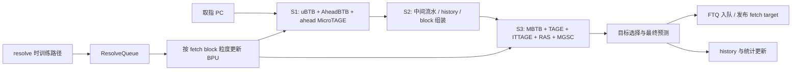

# Kunminghu BPU 顶层设计说明

## 1. 文档范围

本文档说明 Kunminghu BPU 从 `Kunminghu v2` 的 FTB 架构演进到 `Kunminghu v3` 的 BTB 架构时，顶层设计上最重要的动机、约束和权衡。

本文档重点回答：

- 顶层设计的核心目标是什么
- 为什么要从 FTB 架构切换到 BTB 架构
- 为什么 `MBTB` / `TAGE` 等较重逻辑后移到 `S3`
- 为什么需要 `AheadBTB` 和 ahead `MicroTAGE`
- 为什么训练时机从 commit-update 变成 resolve-update

本文档不试图覆盖所有实现细节，也不逐函数解释代码。`MBTB`、`BTBTAGE`、`AheadBTB`、`MicroTAGE`、`ITTAGE`、`MGSC` 等子模块内部设计，后续应由单独文档说明。

当前代码中的对应实现入口：

- `src/cpu/pred/ftb/`：Kunminghu v2 风格的 FTB 顶层
- `src/cpu/pred/btb/`：Kunminghu v3 风格的 BTB 顶层

## 2. 背景

Kunminghu v3 的目标，不只是泛泛地“提升分支预测精度”，而是首先要为 `8` 发射后端提供足够的前端指令供给。

Kunminghu v2 面向 `6` 发射后端，Kunminghu v3 面向 `8` 发射后端。随着后端发射宽度增加，前端供给能力成为关键瓶颈。早期模型探索表明，把 BPU 每拍的有效供给能力从大致 `5+ inst/cycle` 提升到 `8+ inst/cycle`，对支撑 `8` 发射后端非常关键。这也与公开材料中 Kunminghu v3 大约 `22 SPEC CPU2006 score/GHz` 的目标一致。

这一目标直接推动了两项顶层变化：

- fetch block 从 `32B` 扩大到 `64B`
- 单个 fetch block 可容纳的 branch 数从 `2` 提升到 `8`

这里的 `2 -> 8` 指的是“单个 fetch block 的分支容纳能力”提升，不是说“一拍要预测 8 个 taken 分支”。更准确地说，它表示前端不应像旧 FTB 架构那样，因为块内 branch 太多而被迫过早截断当前 fetch block。

这类需求在高分支密度 workload 中尤其明显。`SPEC06 gcc`、`gobmk`、`sjeng` 都是推动这一演进方向的典型观察。

## 3. 为什么 Kunminghu v3 从 FTB 转向 BTB

Kunminghu v3 从 FTB 转向 BTB，核心不是“换一种实现风格”，而是可扩展性问题。

一种直观思路，是继续保留 FTB 架构，只把预测块扩大到 `64B`，同时把块内容纳分支数提升到 `8`。早期模型探索表明，这条路在功能和性能上并非不可行，而且效果确实不错。

但在这个目标下，FTB 架构会暴露两个结构性问题。

第一，预测器成本扩张过快。如果继续沿 FTB 思路支撑更大的预测块和更多的块内 branch，FTB-TAGE 的面积代价会显著上升。

第二，存储组织会越来越不经济。FTB 更接近按 `startPC` 存储，不同 block 起点容易形成不同 entry。当设计试图表达更大的 fetch block 和更高的 branch 密度时，这会带来更多重复存储和冗余。

相对地，BTB 架构更自然地围绕对齐后的分支块组织信息。在当前 v3 设计中，`32B` 对齐块是基本组织单位，`64B` fetch block 由两个相邻的 `32B` block 组成。这样的组织方式更适合 branch 密度高的代码区域。

因此，Kunminghu v3 的顶层设计逻辑是：

1. 后端需要更高的前端供给能力。
2. 更高供给能力要求更大的 fetch block 和更高的块内分支容纳能力。
3. 在这个目标下，FTB 架构在面积和存储效率上都变得不够理想。
4. BTB 架构成为更适合长期演进的方向。

## 4. 顶层架构变化

从顶层看，Kunminghu v3 采用的是一个分阶段、解耦、以 BTB 为组织核心的预测流水。

现有 BTB-TAGE v3 草图可作为辅助参考。该图更适合帮助读者建立模块位置和阶段关系；本文正文仍以文字解释设计动机与权衡为主。

在 gem5 模型中，对应的顶层是 `DecoupledBPUWithBTB`，其主要预测器组成在 `src/cpu/pred/BranchPredictor.py` 中可见：

- `UBTB`
- `AheadBTB`
- `MicroTAGE`
- `MBTB`
- `BTBTAGE`
- `BTBITTAGE`
- `BTBRAS`
- `BTBMGSC`

这里最重要的点不是类名本身，而是 v3 在顶层上明确分离了三类职责：

- 较早、较轻的预测，用来降低 bubble
- 较晚、较重的预测，用来给出最终结果
- 单独的训练/更新路径，用来解耦前后端

## 5. 为什么 MBTB 和 TAGE 要后移到 S3

一旦前端目标变成 `64B` fetch block，并且单个 block 能容纳最多 `8` 条 branch，后级预测逻辑的压力就明显增大了。

此时预测器面对的不再是“小块 + 少量 branch”的情况。它需要在更大的 block 内处理更多 branch 候选，同时完成更复杂的选择逻辑，例如确定当前 block 中真正改变控制流的第一条 taken branch。

这就是 `MBTB` 和 `TAGE` 最终落到 `S3` 的根本原因。

这不是随意的流水重排，而是更大 fetch block 和更高 branch 容纳能力带来的直接结果。若仍要求这些较重逻辑在更早阶段完成，时序压力会明显增大。

这一点在公开的 Kunminghu v3 材料里也能看到：

- `BP1`：`uBTB + aBTB`
- `BP3`：`mBTB + RAS + TAGE + IT-TAGE`

也就是说，顶层架构明确接受了“最终预测点后移”这一代价，以换取更大的 block 能力和可实现的时序。

## 6. 为什么需要 AheadBTB 和 ahead MicroTAGE

较重预测逻辑后移到 `S3` 之后，流水虽然可实现了，但 override 代价也随之增加。

因为最终重预测结果来得更晚，早期粗预测和最终预测之间的距离被拉长了。一旦后级与前级预测不一致，override bubble 就会更贵。

`AheadBTB` 和 ahead `MicroTAGE` 首先是为了解决这个问题而引入的。

它们的第一职责，是补偿 `S3` 后移带来的额外 override 代价。从这个意义上说，它们是更深预测流水下的补偿机制。

但它们不能被简单描述为“时序补丁”。在 Kunminghu v3 中，它们本身也是有效的性能 feature。当前经验判断是，`AheadBTB` 和 ahead `MicroTAGE` 各自都能带来大约 `0.2 SPEC06 score/GHz` 量级的收益。

因此，更准确的表述是：

- 它们因 `S3` 后移而生
- 它们通过提升早期预测质量来降低 override bubble
- 它们同时也是 v3 中独立有效的性能增强部件

## 7. 为什么从 Commit-Update 改为 Resolve-Update

Kunminghu v3 默认采用 resolve-update，而不是 commit-update，`RAS` 是例外。

这一变化最初并不是单一目标驱动的。

一方面，设计时确实希望通过更早训练，让预测器更快看到真实分支结果，从而获得性能收益。另一方面，它也希望更早释放 FTQ 中保存的预测 meta，降低存储压力。

但实际实现后，更早训练带来的性能收益并不显著。这里有两个重要原因。

第一，resolve-update 可能把错误路径上的 branch 也拿去训练。这会污染 `TAGE` 等方向预测器。

第二，resolve-update 引入了额外的控制复杂度。后端并不是把一条完成的 branch 直接交给 BPU 立即更新，而是需要先把解析结果暂存并按 fetch block 粒度重组，再交给顶层 BPU。

当前设计里，这件事通过 `ResolveQueue` 完成。

从顶层视角看，`ResolveQueue` 的作用是：

- 缓冲后端送回的 resolved branch 信息
- 合并属于同一个 fetch block 的多条 resolved branch
- 以 fetch-block 粒度向 BPU 发出训练输入

这种组织方式是有价值的，但也带来了新的复杂度：

- 队列与合并逻辑
- 出队时机约束
- 与预测器 update 时序、bank/resource 冲突的相互作用
- 在高压力下出现队列积压、出队延迟甚至更新请求丢失的风险

因此，关于 resolve-update，顶层层面的准确总结应当是：

- 它的初衷之一是更早训练
- 它更稳定、可确认的收益之一是更早释放 prediction meta
- 它引入了额外的控制复杂度和错误路径污染风险
- 因而它的整体性能收益并没有最初直觉中那么大

## 8. BTB 架构下 v3 的主要收益

Kunminghu v3 采用 BTB 顶层架构，主要收益在于：

- 能更好地支撑 `8` 发射后端的前端供给
- fetch block 从 `32B` 扩展到 `64B`
- 单个 fetch block 的分支容纳能力从 `2` 提升到 `8`
- 对高分支密度代码区域更友好
- 存储组织更贴近对齐分支块，冗余更少
- 能更自然地组合“早期预测”和“最终重预测”

这些才是 v3 顶层演进的核心价值，而不是单纯“又加了几个 predictor”。

## 9. v3 顶层设计的主要代价与权衡

Kunminghu v3 不是无代价升级。它至少引入了以下顶层权衡：

- 较重的最终预测逻辑后移到 `S3`
- override bubble 变得更贵
- 需要额外的早期预测器来补偿这些 bubble
- resolve-update 引入了 `ResolveQueue` 和更复杂的生命周期/控制逻辑
- 错误路径更新污染成为更明确的问题

因此，v3 顶层文档必须把它写成一组有意识的工程权衡，而不是一篇单向的“性能宣传文”。

## 10. 本文档不覆盖的内容

本文档不打算覆盖：

- `FetchTarget`、`FullBTBPrediction`、FTQ metadata 的所有字段
- 各 predictor 内部的 index/tag/train 细节
- 所有局部实现注释的替代说明
- 完整 RTL 级时序说明

这些内容应放在后续的子模块文档或实现说明中。

## 11. 当前 gem5 实现锚点

当前 gem5 模型中可作为实现锚点的文件包括：

- FTB 顶层：
  - `src/cpu/pred/ftb/decoupled_bpred.hh`
  - `src/cpu/pred/ftb/decoupled_bpred.cc`
- BTB 顶层：
  - `src/cpu/pred/btb/decoupled_bpred.hh`
  - `src/cpu/pred/btb/decoupled_bpred.cc`
- BTB 参数配置：
  - `src/cpu/pred/BranchPredictor.py`
- BTB block 组织说明：
  - `src/cpu/pred/btb/docs/btb.md`
- fetch 侧 resolve queue 路径：
  - `src/cpu/o3/fetch.cc`

## 12. 参考资料

- 本目录阅读入口
  - `docs/design-docs/frontend/README.md`
- XiangShan Microarchitecture Design Philosophy, Micro25 slides
  - `https://tutorial.xiangshan.cc/micro25/slides/Microarchitecture%20Design%20Philosophy.pdf`
- XiangShan 公开前端/BPU 设计文档
  - `https://docs.xiangshan.cc/projects/design/zh-cn/latest/frontend/BPU/`
- 本地已有设计说明
  - `docs/design-docs/frontend/phr_design.md`
  - `docs/design-docs/frontend/mbtb_design.md`
  - `docs/design-docs/frontend/btb_tage_design.md`
  - `docs/design-docs/frontend/abtb_design.md`
  - `docs/design-docs/frontend/ubtb_design.md`
  - `docs/design-docs/frontend/microtage_design.md`
  - `docs/design-docs/frontend/mgsc_design.md`

如果后续把现有的 BTB-TAGE v3 草图正式归档到仓库中，可将其作为辅助图链接到这里，而不应让正文理解依赖读者逐框对照原图。
