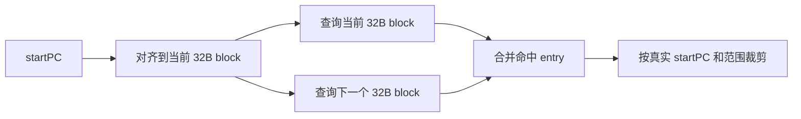

# Kunminghu mBTB 设计说明

## 1. 文档范围

本文档说明 Kunminghu v3 中 `mBTB` 的几个核心设计决策，重点回答：

- 为什么 `mBTB` 继续按 `32B` 对齐块存储，而不是直接做成 `64B`
- 为什么要采用 `half-aligned` 机制
- `32B` 存储粒度如何支撑最多 `64B` 的预测范围
- 为什么还需要 `victimCache`

本文档面向已经具备前端/BPU 基础的读者，不解释所有实现细节，也不逐函数翻译 `mbtb.cc`。`TAGE`、`ITTAGE`、顶层 target selection 等逻辑不在本文档范围内。

## 2. 背景

在 Kunminghu v3 中，顶层前端目标从 Kunminghu v2 的较小 fetch block 进一步扩展到最大 `64B` 的 fetch block，并希望显著提升单个 fetch block 的 branch 容纳能力。

`mBTB` 是这一目标中的关键组成部分，但它面临一个 BTB 架构天然存在的问题：

- BTB 更接近按对齐地址空间组织信息，类似 ICache
- 真实的 fetch block 起始地址 `startPC` 却并不保证天然落在对齐边界上

因此，只要 BTB 的基本存储单元按固定对齐块组织，就会出现“真实预测块被对齐边界截断”的问题。

FTB 架构在这个问题上更自然，因为它更接近按 `startPC + offset` 存储；而 BTB 架构必须显式处理“对齐存储”和“随机起始地址”之间的张力。

`mBTB` 的设计，本质上就是围绕这个矛盾做折中。

### 2.1 mBTB 原理速记

如果只保留最必要的一层理解，可以把 `mBTB` 看成：

- 顶层 BTB 预测链里的主 BTB
- 它负责回答“当前 fetch block 里大概有哪些 branch 候选”
- 同时给出这些 branch 的基本控制流信息，例如：
  - branch PC
  - target
  - branch 类型
  - 对条件分支的基础 taken/not-taken 倾向

后续更重的方向预测器，例如 `TAGE`，是在 `mBTB` 给出的 branch 候选之上继续判断“这些 branch 哪一条更可能真正 taken”。

因此，`mBTB` 面对的首要问题不是复杂历史相关性，而是：

- 这个 fetch block 覆盖范围内有哪些 branch
- 这些 branch 能否被足够完整地取出来
- 高分支密度时会不会直接存不下

这也是为什么 `mBTB` 的设计重点集中在：

- 预测范围
- 对齐存储
- 单块容量

而不是更复杂的历史模式建模。

## 3. 为什么不直接做成 64B 对齐 BTB

一个看起来很直接的方案，是把 `mBTB` 的基本存储粒度直接扩成 `64B`。这样单个 entry 天然就能覆盖一个完整的 v3 fetch block。

但这个方案有一个很明显的问题：一旦真实 `startPC` 靠近一个 `64B` 对齐块尾部，实际可用预测范围会被严重截断。

例如：

- 若 `startPC` 落在一个 `64B` 对齐块的 `60B` 附近
- 那么这个 `64B` block 中从 `startPC` 到块尾只剩约 `4B`

这意味着虽然底层存储粒度扩大到了 `64B`，但在最坏情况下，真实预测范围却会退化得非常糟糕。也就是说，`64B` 对齐 BTB 会让“更大 fetch block”的收益在很多边界位置被浪费掉。

所以 `mBTB` 没有直接选择 `64B` 对齐存储。它优先要解决的问题，不只是“理论上块更大”，而是“在随机 `startPC` 下，真实有效的预测范围不能退化得太差”。

## 4. 32B 存储粒度 + Half-Aligned 查询

### 4.1 核心思路

`mBTB` 当前继续按 `32B` 对齐块存储，但预测时固定查询两个相邻的 `32B` block：

1. 先查 `startPC` 所在的 `32B` 对齐块
2. 再查下一个相邻的 `32B` 对齐块
3. 把两边的命中项合并，再按真实 `startPC` 和预测范围裁剪

这就是 `half-aligned` 机制。

它的作用不是“把两个 32B 简单拼成一个 64B entry”，而是：

- 在保持 `32B` 存储粒度的前提下
- 尽量补偿 BTB 按对齐地址存储所带来的边界截断问题

### 4.2 为什么这样能改善预测范围

如果 `startPC` 非常靠近当前 `32B` block 的尾部，那么当前 block 中剩余空间会很小；但 `half-aligned` 允许 `mBTB` 再向后拼接下一个完整的 `32B` block。

例如：

- 若 `startPC` 落在第一个 `32B` block 的 `30B` 位置附近
- 那么当前 block 只剩约 `2B`
- 但下一个 `32B` block 仍然完整可用

此时有效预测范围就是：

- 当前 block 剩余部分 `2B`
- 加上下一个完整 `32B`

总计约 `34B`

在 RISC-V 中，由于压缩指令存在，最小指令粒度是 `2B`，因此 `startPC` 不会落在奇数字节位置。这也是这里最小范围是 `34B` 而不是 `33B` 的原因。

所以当前 `mBTB` 在这个设计下，能提供的大致预测范围能力可以理解为：

- 最坏情况约 `34B`
- 最好情况接近 `64B`

也就是说，`half-aligned` 把范围能力从“严重依赖单个对齐块剩余空间”提升成了“至少还有一个后续 `32B` block 可以拼上”。

### 4.3 这不等于单块容量变成 8-way

这一点很容易被误解。

`half-aligned` 让一次预测可以看到两个相邻 `32B` half-block，但这不意味着“单个 block 直接变成 8-way”。

更准确地说：

- 对整个 `64B` fetch block 看，一次预测确实能看到两个相邻 `32B` block 的内容
- 但对每个 `32B` block 单独看，直接容量上限仍然只有 `4-way`

所以“64B 范围内可见 entry 变多”不等于“单个 32B block 自己变成 8-way”。

## 5. 当前的存储组织

`mBTB` 当前采用 dual-SRAM 组织：

- 两个独立的 SRAM：`sram0` 和 `sram1`
- 每个 SRAM 内部是 `4-way`
- `32B` 对齐地址通过 `PC[5]` 选择落到哪个 SRAM

简化理解如下：

这套组织的含义是：

- 存储上仍然维持较细的 `32B` 粒度
- 查询上通过 `half-aligned` 扩展到最多 `64B`
- 因此它是在“范围能力”和“存储效率”之间取折中，而不是简单地把所有东西都放大一倍

## 6. 为什么还需要 Victim Cache

`half-aligned` 解决的是范围问题，但它并不解决另一个独立问题：单个 `32B` half-block 的直接容量只有 `4-way`。

这意味着：

- 如果某个 `32B` 范围内 branch 密度很高
- 一旦有效 branch 数超过 `4`
- `mBTB` 就会开始替换已经存在的 valid entry

代码里对此有非常直接的注释：

- `means 32B block is more than 4ways / 4 branches`

这就是 `victimCache` 要补的缺口。

### 6.1 要解决什么问题

当单个 `32B` block 里 branch 超过 `4` 条时，`mBTB` 可能出现 ping-pong 效应：

- 新 entry 写入时挤掉旧 entry
- 被挤掉的旧 entry 很快又可能再次成为热点
- 结果是这些 entry 在有限的 `4-way` 容量里反复互相替换

如果没有额外缓冲，这种 branch 可能在前端直接存不下，最终对应的 redirect 只能在 resolve 阶段才被发现，从而付出十余拍级别的 flush penalty。

`sjeng` 是这类问题的典型场景。当前已观察到单个 `32B` 范围内可能出现 `7` 条 branch。

### 6.2 Victim Cache 的作用

`victimCache` 是一个小型全相联缓冲，用来保存最近从 `mBTB` SRAM 中被替换出去的 entry。

它的作用不是一般意义上的“再加一级 cache 提升命中率”，而是更具体地：

- 补足单个 `32B / 4-way` half-block 在高分支密度场景下的容量缺口
- 缓和 entry 在主 SRAM 中反复互相替换的 ping-pong 行为

实现上：

- 当 valid entry 被 SRAM 挤出时，会被放入 `victimCache`
- 后续查询时，`victimCache` 也会跟随 `half-aligned` 一起查两个相邻 `32B` block
- 若更新命中 `victimCache`，代码会直接在 VC 中就地更新，以避免 `mBTB` 与 VC 间继续 ping-pong

### 6.3 当前已知收益和工程状态

当前经验判断是，`victimCache` 的收益量级约为 `0.2 分/GHz`。

相关工程背景可参考：

- PR: `OpenXiangShan/GEM5#826`

这个方向在 gem5 侧已经能观察到收益，但 RTL 侧仍在评估对应实现是否能满足时序要求。因此，`victimCache` 应被视为：

- 一个很有现实收益的补强机制
- 但同时也可能带来更密集 block 场景下的额外时序/内部复杂度考量

## 7. 为什么不直接进一步细化到 16B

理论上，也可以把存储粒度进一步细化到 `16B`，以进一步减轻对齐截断问题。

但当前这一方向并未系统评估。并且，更细粒度并不只会“让问题更小”，它会改变问题的形态。例如：

- 当前 `32B + half-aligned` 更多是在补偿 fallthrough 范围被截断
- 若继续细化粒度，被截断或被切分影响的对象可能更直接地变成 taken branch 所在位置

因此，在没有完整评估之前，`16B` 更适合作为可讨论的替代方案，而不是本文档中的主设计方向。

## 8. 设计总结

`mBTB` 当前设计可以概括成三句话：

1. 不直接做 `64B` 对齐存储，因为那会让真实 `startPC` 靠近块尾时的最坏预测范围退化得过于严重。
2. 采用 `32B` 存储粒度加 `half-aligned` 查询，以较好的存储效率换取 `34B ~ 64B` 的有效预测范围能力。
3. 再用 `victimCache` 补足单个 `32B / 4-way` half-block 在高分支密度场景下的容量短板。

所以 `mBTB` 不是单纯的“大 BTB”，而是一个围绕以下两个问题同时做折中的结构：

- 对齐存储导致的范围截断
- 单个 `32B` half-block 容量有限导致的高密度 branch 冲突

## 9. 实现锚点

当前实现中最相关的文件有：

- `src/cpu/pred/btb/mbtb.hh`
- `src/cpu/pred/btb/mbtb.cc`
- `src/cpu/pred/btb/docs/btb.md`
- `src/cpu/pred/BranchPredictor.py`
- `src/cpu/pred/btb/test/btb.test.cc`

## 10. 参考资料

- `docs/design-docs/frontend/bpu_top_level.md`
- `OpenXiangShan/GEM5#826`
