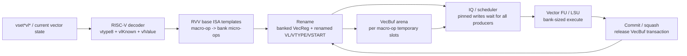

# Jingtao V2 RVV 向量化设计说明

## 1. 文档范围

本文档说明从腾讯 Jingtao V2 分支迁入的 RISC-V Vector 相关设计，以及当前在
GEM5_5 主线上的取舍。

本文档重点回答：

- 这次 RVV 迁移的核心设计目标是什么
- 为什么要从整条向量寄存器建模转向 `DPLEN` bank 粒度
- 为什么需要 `VecBufRegClass` 作为向量微操作的临时寄存器空间
- `VL` / `VTYPE` / `VSTART` 如何进入 rename 和 decode 可见状态
- `simple` RVV 实现为什么被合并到 `base`，以及 CI 参数如何兼容
- 当前 vtype predictor 做到了什么、还缺什么、为什么会影响性能
- 哪些源提交里的旁支改动没有迁入

本文档不逐条解释所有 RVV 指令模板，也不替代 RISC-V V spec。它关注的是当前
gem5 模型中影响理解和后续维护的顶层设计。

当前代码中的主要实现入口：

- `src/arch/riscv/types.hh`：`VLEN`、`DPLEN`、`VregBanks` 和 `ExtMachInst`
  中的 `vtype8` / `vlKnown` / `vlValue`
- `src/arch/riscv/regs/vector.hh`：banked vector register、`VecBuf`、renamed
  vector misc register 定义
- `src/arch/riscv/insts/vector.hh` / `vector.cc`：向量 macro / micro inst
  公共类和 VecBuf merge/reduce/compress/gather 辅助微操作
- `src/arch/riscv/isa/vector/base/`：RVV decode 与 arithmetic / memory /
  config 模板
- `src/cpu/o3/rename.cc` / `rename.hh`：`VecBuf` transaction 生命周期
- `src/cpu/o3/regfile.*`、`src/cpu/reg_class.hh`：新的物理寄存器类别和寄存器文件
- `src/cpu/FuncUnit.py`、`src/cpu/o3/FuncUnitConfig.py`：更细粒度的 vector
  op class 与功能单元映射

## 2. 背景

GEM5_5 主线原来已经有 RISC-V Vector 支持，但整体更接近“功能正确优先”的
整寄存器模型。旧模型里一个 architectural vector register 直接对应完整
`VLEN` 宽度，decode / execute 侧很多路径也按整条向量处理。

腾讯 Jingtao V2 分支的最新提交把 RVV 模型推进到更接近执行资源粒度的形态：

- architectural vector register 被拆成多个 `DPLEN` bank
- vector macro instruction 根据 `SEW` / `LMUL` / `VL` 拆成多个 micro-op
- memory、reduction、compress、gather 等多阶段操作使用 `VecBuf` 作为临时空间
- `VL` / `VTYPE` 作为 renameable misc register 被显式接入数据依赖
- 功能单元 op class 由粗粒度 vector class 拆成更贴近操作族的 class

源提交同时包含不少非向量旁支，例如 fusion、scheduler 配置、trace writer、
prefetch、TLB/memory、脚本和 CI 侧改动。本分支没有直接 cherry-pick 整个提交，
而是只迁入和 RVV 核心建模相关的部分，避免把当前 GEM5_5 主线已有的 O3 / frontend
改动打散。

## 3. 顶层设计判断

这次迁移的核心不是“多支持一些 RVV 指令”，而是把 RVV 的表达粒度从完整
`VLEN` 向量推进到 `DPLEN` bank。

当前参数关系是：

- `VLEN = 256 bit`
- `DPLEN = 128 bit`
- `VregBanks = VLEN / DPLEN = 2`
- 一个 architectural vector register `vN` 在 rename 空间中表现为
  `vN[127:0]` 和 `vN[255:128]` 两个 `VecRegClass` register
- `VecBufRegClass` 的每个 slot 也是 `DPLENB` 大小，用作 macro-op 内部的临时
  scratchpad

这个粒度变化带来两个直接结果。

第一，RVV micro-op 可以按 bank 发射、写回和统计。模型不再把一个完整 `VLEN`
寄存器视为不可分割的执行对象，而是让向量资源压力更自然地进入 IQ、scheduler、
regfile 和 FU op class。

第二，多阶段向量操作需要临时值生命周期管理。例如 segment load、indexed load、
reduction tree、compress、gather 等操作，往往先生成中间 bank/slot，再 merge
回 architectural vector bank。`VecBuf` 就是为这类“属于同一条 macro 指令、但
不应长期占用 architectural map”的中间值准备的。

顶层数据流可以概括为：

## 4. Banked VecReg 与 VecBuf

旧模型中 `VecRegClass` 的寄存器宽度是 `VLENB`。迁移后，`VecRegClass` 的寄存器
宽度变成 `DPLENB`，architectural register 数量扩展为 `32 * VregBanks`。

这意味着：

- `v0` 的低 bank 是 `RegId(VecRegClass, 0)`
- `v0` 的高 bank 是 `RegId(VecRegClass, 1)`
- `v1` 从 `RegId(VecRegClass, 2)` 开始
- debug/disassembly 中的 register name 会打印成 `vN[hi:lo]`

`VecBufRegClass` 是新的 register class。它不是 architectural vector register，
而是 RVV macro-op 内部的临时 bank-sized buffer。当前定义中 architectural
`VecBuf` slot 数为 `16`，物理 `VecBuf` register 数默认是 `128`。

这里有一个关键设计点：`VecBuf` 的逻辑 slot 会在同一条 macro-op 的多个 micro-op
之间复用，但不能泄漏到下一条无关 macro-op。因此 O3 rename 侧引入了
`VecBufArenaTxn`：

- 当 rename 看到含 `VecBufRegClass` operand 的 micro-op 时，为该 macro-op 建立
  active transaction
- 同一 transaction 内，逻辑 slot 到物理 `VecBuf` register 的映射保持稳定
- 当 macro-op 的最后一个 micro-op 经过 rename 后，transaction 进入 commit queue
- commit 到对应 seqNum 后释放 transaction 分配的所有物理 `VecBuf`
- squash 时释放被 squash 覆盖的 active / pending transaction

这套 transaction 机制避免了把 `VecBuf` 放入普通 architectural rename map 后长期
持有，也避免了不同 macro-op 的临时 slot 互相踩踏。

## 5. Pinned Writes

有些 `VecBuf` slot 不是由单个 micro-op 写完，而是由多个 producer 分片填充。
例如 segment load 的多个 field、FOF load 的辅助状态、reduction / compress 的
中间结果，都可能落在同一个逻辑 slot 上。

为此模型使用 `numPinnedWrites` / `numPinnedWritesToComplete`：

- decode/constructor 侧通过 `RegId::setNumPinnedWrites()` 标记一个 destination
  预计会有多少次写入
- rename 分配物理 `VecBuf` register 时，把 expected writes 写到物理寄存器元数据
- scheduler / writeback 只有在 pinned writes 完成后才把该物理 register 视为 ready
- squash 或 commit 释放 transaction 时，未完成的临时寄存器也会被回收

这个设计表达的是“多个 micro-op 共同生产一个临时 bank 值”。它不是普通的
architectural 多写回，因为最终 architectural vector bank 仍由后续 merge 或 final
micro-op 写入。

## 6. VL / VTYPE / VSTART 的 rename 化

RVV 指令的拆分依赖 `vtype` 和 `vl`。如果 decode 无法知道当前 `vtype`，就无法正确
决定 `SEW`、`LMUL`、bank 数量和 operand 映射。

当前模型做了三件事：

1. `ExtMachInst` 携带 `vtype8`，让 vector templates 在 decode 时看到当前
   `VTYPE` 的低 8 位。
2. `ExtMachInst` 增加 `vlKnown` / `vlValue`，当 decoder 可以保守确定 `VL` 时，
   templates 可以减少不必要的 micro-op。
3. `VL`、`VTYPE`、`VSTART` 对应 renamed misc register：
   `VecRenamedVLReg`、`VecRenamedVTYPEReg`、`VecRenamedVSTARTReg`。

`vlKnown` 的计算是保守的。当前 decoder 只在这些场景下认为 `VL` 可知：

- `vsetivli`：`VL = min(uimm, VLMAX)`
- `vsetvli` / `vsetvl` 的 `rs1 == x0 && rd != x0`：`VL = VLMAX`
- `rs1 == x0 && rd == x0` 且 decoder 之前已经知道 `VL`：按新的 `VLMAX` 夹紧

当 `VL` 可知时，arithmetic 和 memory templates 会把 micro-op 数量裁到真实活跃
元素范围。例如 narrowing、load/store、segment load/store 都会用 `vlValue` 限制
bank 循环，减少空转 micro-op。

`csrr rd, vl` 被特殊化成 `VLReadOp`。它不再走普通 CSR 序列化路径，而是直接读取
renamed `VL` 作为整数源操作数。这让软件常见的 `csrr vl` 查询不会无谓阻塞整个
pipeline。

## 7. Vector Config 的处理原则

`vsetvli`、`vsetivli` 和 `vsetvl` 统一使用 `VConfOp`。

当前实现的主要语义点：

- `vset*` 会写 renamed `VL` 和 renamed `VTYPE`
- `vsetvli` / `vsetivli` 的 immediate `vtype` 可以在 decode 阶段提前注入
- `vsetvl` 的 register-form `vtype` 仍然需要等执行结果确认
- 所有 `vset*` 在执行时检查 `mstatus.VS`，`VS=Off` 时返回 illegal instruction
- `vill`、reserved bits、非法 `vsew` / `vlmul` 组合在执行时被规整为 spec 期望的
  illegal `vtype`
- `VSTART` 在执行 `vset*` 时清零，并作为 renamed source 被后续 merge/exception
  敏感路径使用

这里的理念是：decode 阶段只做“可保守确定”的早期优化，最终 architectural vector
state 仍由执行/提交路径确认。

## 8. ISA 生成与编译压力

Jingtao V2 的 vector templates 大量使用 C++ template class。直接把所有 template
definition 留在 generated decoder header 中，会让多个 translation unit 重复解析
巨大模板，编译压力很高。

因此 `src/arch/isa_parser/isa_parser.py` 增加了 template implementation 抽取逻辑：

- template class declaration 保留在 `decoder-ns.hh.inc`
- template method implementation 抽到 generated implementation
- implementation 再拆成 `decoder-tpl-*.cc.inc`
- `src/arch/SConscript` 新增 `template_splits`
- RISC-V 目前使用 `template_splits=32`

这属于构建可维护性设计，不改变 ISA 行为。它的作用是让大规模 RVV template 仍然能在
现有 build 系统中并行编译，而不是把所有 template instantiation 压在一个 generated
translation unit 里。

## 9. Base 与 Simple 的关系

旧仓库同时有 `vector/base` 和 `vector/simple` 两套 RVV ISA 目录。这次迁移后，
Jingtao V2 的新向量模型落在 `vector/base`，旧 `vector/simple` 目录被删除。

当前设计决策是：

- `base` 成为唯一真实 RVV 实现
- 保留 SCons 参数 `--rvv-impl=simple`
- 当用户或 CI 传入 `simple` 时，在 `SConstruct` 中把它映射为 `base`

这样做有两个目的。

第一，避免继续维护两套含义已经重叠的 RVV ISA templates。迁移后的 `base` 已经包含
原来 `simple` 想表达的 bank/micro-op 行为，再保留旧目录会增加误用风险。

第二，保持现有 CI 和脚本兼容。当前 `.github/workflows/gem5-vector.yml`、
`.github/workflows/gem5.yml` 的 RVV smoke 以及 on-demand RVV SPEC 都仍会传
`--rvv-impl=simple` 或 `vector_type=simple`。如果不做 alias，这些 CI 会因为
`vector/simple` 目录消失而直接失败。

## 10. O3 支撑变化

为了支撑 banked RVV，O3 侧做了以下配套：

- `BaseO3CPU.py`
  - `numPhysVecRegs` 从 `192` 增加到 `384`
  - 新增 `numPhysVecBufRegs = 128`
- `regfile.cc` / `regfile.hh`
  - 增加 `vecBufRegFile` 和 `vecBufRegIds`
  - `VecBufRegClass` 进入 free list、get/set、flat index 统计路径
- `cpu.cc`
  - 构造物理寄存器文件时传入 `numPhysVecBufRegs`
  - difftest 读取 architectural vector register 时按 bank 拼回完整 `VLEN`
- `base.cc`
  - difftest 的 architectural vector register 比较和显示使用 `NumArchVecElemPerReg`
    覆盖完整 `VLEN`，不使用单个 `DPLEN` bank 宽度
- `rename.cc` / `rename.hh`
  - 增加 `VecBufArenaTxn`
  - source operand 优先从 active transaction 的 slot map 查找
  - destination operand 为 `VecBufRegClass` 时进入 transaction 分配路径
- `inst_queue.cc` / `issue_queue.cc`
  - 物理寄存器数量统计纳入 `VecBuf`
  - pinned writes 未完成时不提前 wakeup / bypass
- `dyn_inst.hh`
  - squash/forwarding 旧 destination value 时支持 `VecBufRegClass`

这些变化把 `VecBuf` 放进 O3 的普通数据依赖和 ready 机制里，但用 transaction 限制
它的生命周期，使它更像 macro-op 内部 scratchpad，而不是新的 architectural state。

## 11. 功能单元与 OpClass

旧 vector op class 较粗，例如 integer arith、float convert、integer reduce、
float reduce、misc。迁移后 op class 被拆得更细：

- integer：`VectorArith`、`VectorSpecialFunc`、`VectorMult`、
  `VectorMultAcc`、`VectorReduction`、`VectorDiv`
- permute/misc：`VectorMisc0`、`VectorMisc1`、`VectorPermute`
- floating：`VectorFloatArith`、`VectorFloatCmp`、`VectorFloatMult`、
  `VectorFloatMultAcc`、`VectorFloatDiv`
- conversion：`VectorConvertF2F`、`VectorConvertF2I`、
  `VectorConvertI2F`、`VectorConvertI2I`
- config：`VectorConfig`

当前 O3 `SIMD_Unit` 先把这些 class 都挂到同一个 SIMD FU 上，其中 div class
非 pipeline。这个设计当前更偏“分类正确、便于后续调参”，还没有把每类资源映射成
完全独立的硬件端口模型。

## 12. vtype Predictor 的当前状态

本次迁移带入了 vtype predictor 的一部分接口：

- `src/arch/riscv/vtype_pred.hh` 定义了一个 direct-mapped PC -> vtype 表
- `RiscvDecoder.py` 增加 `vtype_pred_entries`
- decoder 中增加了 `tryPredictVtype()`、`updateVtypePredictor()`、
  `isVtypePredicted()` 等接口
- register-form `vsetvl` 在 decode 阶段会尝试查 predictor；如果 miss，则保持旧逻辑，
  `clearVtype()` 并让 decoder stall

但这还不是完整 predictor。当前还缺：

- 没有任何调用点更新 predictor，所以表项不会学习
- 没有把 predicted vtype 绑定到动态指令 metadata
- 没有在 IEW / commit 比较 predicted vtype 与实际 vtype
- 没有 mismatch 后对已经按错误 vtype decode 的年轻指令进行可靠 squash / re-decode
- 没有 predictor checkpoint、rollback、stats

因此当前结论是：vtype predictor 接口已迁入，但功能闭环尚未完成。它现在不影响正确性，
也基本不会带来性能收益。

这部分对性能应该是有影响的。原因是 register-form `vsetvl` 常出现在向量化循环中，
同一个 PC 的 `vtype` 往往稳定。如果 predictor 完整实现，热循环中可以避免每次
register-form `vsetvl` 都让 decoder 等到 commit 后才恢复 `vtypeReady`，也可以让后续
vector macro-op 更早按正确 `vtype` 展开。

不过 predictor 不能只补 `update()`。一旦允许 predictor 命中，decode 可能已经按预测
`vtype` 生成了年轻 vector instruction 的 StaticInst / micro-op。如果预测错误，必须能
精确清掉这些年轻指令并重新 decode。因此这部分适合下一轮单独做，不能夹在当前首次迁移
里半接入。

## 13. 本次没有迁入的源提交内容

源提交中未迁入的主要旁支包括：

- `configs/common/FUScheduler.py` 大规模调度器重写
- `configs/common/Options.py` / `Simulation.py` / `configs/example/xiangshan.py`
  的脚本和配置改动
- `scripts/` 下 RVV 下载、批量测试、score helper 等脚本
- scalar fusion 相关 `src/arch/riscv/insts/fusion.*` 和 decoder sidecar
- O3 `fetch` / `decode` / `iew` / `commit` / `rob` / `lsq` 的大范围旁支改动
- `perf_trace_writer`、`cp_resource_slot`、prefetch、packet/request、TLB/memory
  等非 RVV 核心建模改动

这些内容不一定没有价值，但它们与本次“把 RVV 核心模型合到 GEM5_5 主线”的目标耦合度
不够高，且会显著增加冲突面和验证面。当前策略是先让 RVV 核心模型可编译、可运行、可
触发 RVV CI，再决定是否单独迁入后续性能或脚本改动。

## 14. 验证入口

本分支需要关注两类 RVV CI。

第一类是 vector smoke / functional test：

- `.github/workflows/gem5-vector.yml`
  - build：`scons build/RISCV/gem5.opt --linker=gold -j64 --rvv-impl=simple`
  - run：`.github/workflows/autotest/gem5-vec.cfg`
  - workload：`/nfs/home/share/gem5_ci/vector_test/*.bin`
- `.github/workflows/gem5.yml` 中的 `new_sim_script_test_gcbv`
  - build 同样传 `--rvv-impl=simple`
  - 运行 `util/xs_scripts/kmh_6wide_vector.sh`

第二类是 RVV SPEC performance test：

- `.github/workflows/on-demand-spec-rvv.yml`
  - PR 加 `rvv` label 时触发
  - 当前默认跑 `spec06int-rvv-0.8c`
  - `vector_type=simple`，通过本次 alias 映射到 `base`
- `.github/workflows/manual-perf.yml`
  - 可手动触发 `spec06int-rvv-0.8c`
  - 也可手动触发 `spec06-rvv-1.0c`

因此本次提交前至少应验证：

- default build：`scons build/RISCV/gem5.opt --gold-linker -j64`
- compatibility build：`scons build/RISCV/gem5.opt --gold-linker -j64 --rvv-impl=simple`
- 轻量 runtime：`./build/RISCV/gem5.opt --help`

当前本地验证记录：

- `scons build/RISCV/gem5.opt --gold-linker -j64` 通过
- `scons build/RISCV/gem5.opt --gold-linker -j64 --rvv-impl=simple` 通过，
  `simple` 被映射到 `base`
- `git diff --check` 通过
- `vsetvli-0.bin` 在关闭 difftest 后可以跑到 `m5_exit`

当前本地有 difftest 的 RVV smoke 没有作为通过项记录。原因是本地可见 NEMU ref so
仍是 `VLEN=128` 的 difftest ABI，而本分支 gem5 RVV 架构宽度是 `VLEN=256`。二者的
`DiffTestState::vr[32]` 宽度不同，`vtype` / `vl` 在结构体里的偏移也不同；因此 NEMU
写回的 vector CSR 会落在 gem5 认为的其他位置，表现为 `referenceRegFile.vtype/vl`
为 0 或早期 CSR 差异。

已确认的本地 NEMU 口径：

- `/nfs/home/yanyue/workspace/NEMU/src/isa/riscv64/instr/rvv/vreg.h` 中
  `#define VLEN 128`
- `/nfs/home/yanyue/workspace/NEMU/ready-to-run/riscv64-nemu-interpreter-so`
  与本分支早期 CSR 口径也不匹配
- `/nfs/home/yanyue/workspace/NEMU/build/riscv64-nemu-interpreter-so` 能走到
  `vsetvli`，但随后出现 `vtype` / `vl` difftest offset mismatch

因此，远端 RVV CI 需要使用与本分支一致的 `VLEN=256` NEMU ref so，或者该类 RVV
functional smoke 需要关闭 difftest 后先确认 gem5 自身执行路径。当前本地
`--disable-difftest` 的 `vsetvli-0.bin` 结果支持后一个判断。

如果本地机器和 checkpoint 路径可用，再补跑 `.github/workflows/autotest/gem5-vec.cfg`
对应的 vector smoke。若本地资源不足，则以远端 CI 的 `gem5-vector` / RVV SPEC 结果
作为主要功能和性能验证。

## 15. 当前设计风险

当前分支最大的风险不是单个指令模板，而是生命周期和精确性：

- `VecBuf` transaction 必须在 commit / squash 下都正确释放，否则会泄漏物理寄存器或
  复用错误 slot
- pinned writes 必须只在所有 producer 完成后唤醒消费者，否则会读到部分写入的临时值
- `vlKnown` 必须保持保守，不能把 runtime `VL` 当成 decode-time constant
- register-form `vsetvl` 的 predictor 不能半接入，否则会产生按错误 `vtype` decode 的
  年轻指令
- `--rvv-impl=simple` 现在只是兼容 alias，不再代表一套独立 ISA implementation

后续如果要继续追性能，优先级建议是：

1. 先用 RVV functional / SPEC CI 确认当前 banked model 的正确性。
2. 单独补齐 vtype predictor 的 update、mismatch 检测、squash / rollback、stats。
3. 再看是否需要迁入源提交里的更激进 O3 scheduler / FU 资源建模。
4. 最后再决定是否把源提交里的 RVV 脚本和 benchmark helper 独立整理进仓库。
