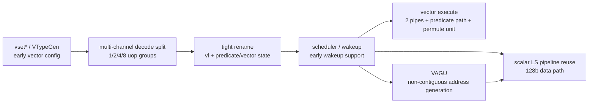
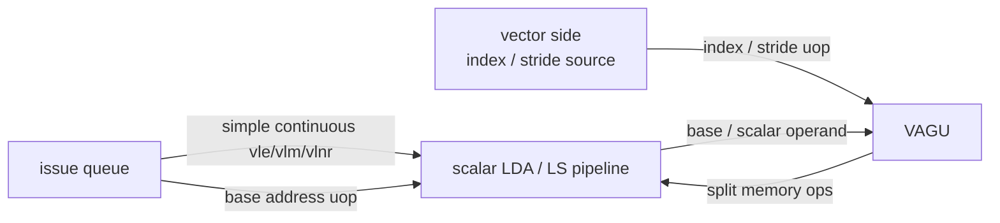

# Kunminghu v3 RVV 向量设计说明

## 1. 文档范围

本文档说明 Kunminghu v3 后续 RVV 向量设计的顶层思路，并将它与当前从腾讯
Jingtao V2 分支迁入的 RVV 模型进行对比。

本文档重点回答：

- Kunminghu v3 向量设计首先想解决哪些旧设计瓶颈
- 为什么新方案强调 decode 多通道拆分、谓词调度重构、permutation 专用结构和复用
  标量访存流水线
- 这些设计与 Jingtao V2 的 banked `DPLEN` / `VecBuf` 模型有哪些一致点和冲突点
- Jingtao V2 是否适合作为一个独立开关长期保留
- gem5 后续对齐 Kunminghu v3 时，应优先保留哪些基础设施，又应避免哪些错误抽象

本文档不逐条解释 RVV 指令语义，也不替代 RISC-V Vector spec。它关注的是影响后续
gem5 性能模型和 RTL 对齐的微结构设计决策。

当前相关文档和实现入口：

- `docs/design-docs/riscv_vector_jingtao_v2.md`：Jingtao V2 迁移模型说明
- `src/arch/riscv/isa/vector/base/`：当前 RVV ISA template 和 macro/micro-op 拆分
- `src/arch/riscv/types.hh`：当前 `VLEN` / `DPLEN` / `VregBanks` 和 decode 可见字段
- `src/arch/riscv/regs/vector.hh`：当前 banked vector register、`VecBuf` 和 renamed
  vector misc register
- `src/cpu/o3/rename.*`、`src/cpu/o3/regfile.*`、`src/cpu/o3/inst_queue.*`：
  当前 O3 侧对 banked RVV 和 `VecBuf` 的支撑

## 2. 背景

Kunminghu v3 的向量方案不是单纯“补齐 RVV 功能正确性”，而是针对旧向量微结构中已经
暴露出的性能瓶颈做体系化重构。

从 PPT 中给出的基本规格看，Kunminghu v3 向量设计的基线假设是：

- 指令集支持 RISC-V Vector、`Zvfh`、`Zvbb`
- `VLEN = 128bit`
- `2` 条向量流水线
- 支持 `INT8~64`、`FP16~64`，暂不支持 `BF16`
- 支持全部 `LMUL` 配置，最大向量长度为 `1024bit`
- 采用紧耦合 rename 架构
- 以向量寄存器粒度拆分 uop
- 通过 ROB 压缩支持 `LMUL > 1`
- `vl` 寄存器进入 rename
- 复用标量访存流水线，并将数据位宽扩展到 `128bit`

这些约束决定了新方案的核心方向：不要把 RVV 当作一个远离标量后端的独立执行岛，而是
让向量指令尽量复用已有后端资源，同时针对向量独有的高 LMUL、谓词、permute 和复杂访存
场景加入必要的专用结构。

## 3. 旧设计瓶颈

PPT 对旧向量设计的瓶颈归因很集中，主要分为五类。

第一，decode 输出 uop 吞吐不足。RVV 使用独立配置指令设置 `VL`、`SEW`、`LMUL` 等状态，
后续向量运算的拆分依赖配置结果。旧设计中配置指令执行后才能指导运算指令拆分，连续向量
指令流会在 decode 前形成 bubble。同时，单通道拆分使连续向量指令每周期输出 uop 数受
`LMUL` 限制。

第二，调度缺少提前唤醒。向量运算和向量 load 都没有充分支持 early wakeup，等效执行延迟
被额外拉长。PPT 中明确提到向量 load 需要支持提前写回后的 `3 cycle` 唤醒。

第三，`LMUL > 1` 的谓词运算无法并行。旧路径中多个 predicate uop 之间存在对 `v0` 的
RAW 依赖，导致谓词生成指令在高 LMUL 场景中成为串行关键路径。

第四，permutation 类指令延迟极高。`vrgather`、`vslideup/down`、`vcompress` 以及
segment 访存本质上都需要硬件替软件完成循环。旧方案在 `LMUL=8` 时延迟被放大得非常严重，
例如 PPT 中给出的旧 XS `vrgather m8` 预期延迟达到 `250`，`compress m8` 为 `152`，
`slide m8` 为 `112`。

第五，向量访存与标量访存隔离过重。旧方案有独立 VLSU IQ，还需要额外 `i2v` uop 把基地址
搬到向量域；向量访存和非对齐处理耦合在 merge buffer 中；`fof`、strided、segment 等
路径没有充分利用内存连续性；简单连续 `vle` 延迟约 `10+ cycle`，并且没有 vload 推测唤醒。

这些问题共同说明：旧设计的主要矛盾不是单条指令功能是否存在，而是高 LMUL 下的 uop 供给、
依赖表达、资源复用和特殊操作延迟都没有形成面向性能的整体方案。

## 4. 顶层设计理念

Kunminghu v3 向量方案可以概括为四个设计理念。

第一，decode 阶段必须把 RVV 的配置依赖变成可控的吞吐问题。`vset*` 引入的 `vtype/vl`
依赖不能让连续向量流长期被配置指令串行化，因此需要 VTypeGen 或类似机制在 decode 附近
尽早给出可用于拆分的推测配置状态。

第二，高 LMUL 不能简单靠“更多 uop 慢慢排队”解决。新方案强调以向量寄存器粒度拆分，并用
ROB 压缩支持 `LMUL > 1`。这表示模型需要区分“执行资源需要处理多个 register group”和
“ROB / rename / issue 结构是否被无谓膨胀”。

第三，谓词、permute、复杂访存是 RVV 性能模型的特殊矛盾，需要专门建模。它们不能只被当成
普通 SIMD 算子，因为它们在 `LMUL`、`v0`、跨元素重排、地址生成和内存连续性上有独立瓶颈。

第四，简单连续向量访存应尽量走标量 LS 快路径。最常见的 `vle`、`vlm`、`vlnr` 等路径不应
被独立 VLSU 和 merge buffer 拉长。复杂访存可以先经过 VAGU 拆成 memory op，再复用标量
访存流水。

整体数据流可以抽象为：

## 5. Decode 和指令拆分

RVV 的一个结构性问题是：运算指令的拆分依赖 `VTYPE`。如果 `vsetvli` / `vsetivli` /
`vsetvl` 必须执行完成后才能拆分后续向量指令，decode 会在连续向量代码中产生明显 bubble。

Kunminghu v3 的方案是让配置指令在 VTypeGen 中推测执行，`1` 拍后指导译码拆分。这样可以把
原本“配置执行 -> 运算拆分”的控制依赖前移到 decode 附近处理。

更关键的是，新方案不是继续使用单通道拆分，而是采用多通道拆分：

- 限制拆分 uop 数量为 `1`、`2`、`4`、`8`
- 不足时补 NOP
- 在 `8` 发射配置下，混合指令流译码拆分可以 `1` 拍完成
- 除 `seg3/5/6/7` load/store 等特殊指令外，保持 `8` 条 uop 吞吐
- 初步 DC 评估最长路径小于 `200ps`

这里的核心取舍是：为了获得稳定的 decode 吞吐，拆分形态被刻意规整到少数组大小。
补 NOP 看起来浪费，但它换来的是 decode 结构规整、时序可控，以及连续向量流不会被
`LMUL` 线性拖慢。

对 gem5 建模来说，这一节最重要的不是 NOP 本身，而是 decode throughput 和 uop group
shape。后续模型应能表达：

- `vtype/vl` 的早期推测状态
- 向量 macro-op 到 `1/2/4/8` uop group 的规整拆分
- 由补齐或特殊 segment 指令带来的有效 uop 与资源占用差异
- decode 端吞吐限制，而不是只在 execute 端统计延迟

## 6. VL / VTYPE / VTypeGen

Kunminghu v3 和 Jingtao V2 都意识到 `vtype/vl` 对 decode 拆分很关键，但两者表达的层次
不同。

Kunminghu v3 方案中的 VTypeGen 是前端/译码附近的推测配置生成机制。它要解决的是：

- 独立配置指令与后续向量拆分之间的控制依赖
- 连续向量指令前的 bubble
- decode 多通道拆分需要及时知道的 `SEW` / `LMUL` / `VL` 状态

当前 Jingtao V2 迁移模型中，`ExtMachInst` 增加了 `vtype8`、`vlKnown` 和 `vlValue`，
并把 `VL` / `VTYPE` / `VSTART` 接入 renamed misc register。这是有价值的基础设施，
但它更像 decode assist，而不是完整的 VTypeGen / vtype predictor。

目前它还缺少完整 predictor 应有的几个部分：

- 对预测状态的更新路径
- 预测错误后的检查和 squash
- 错误预测带来的重定向或重新拆分成本
- predictor hit/miss、mismatch、bubble 等统计
- 与 decode 多通道拆分吞吐的统一模型

因此，当前 Jingtao V2 的 `vlKnown` 优化可以减少部分空 micro-op，但还不能代表
Kunminghu v3 的 VTypeGen 性能模型。这个差异会影响性能，因为 `vset* -> vector op`
之间是否产生 bubble、是否重新拆分、以及配置预测失败时的恢复成本，都会直接改变连续
RVV 代码的前端供给。

## 7. Rename、ROB 压缩和 uop 粒度

Kunminghu v3 PPT 明确写的是“以向量寄存器粒度拆分 uop”，并通过 ROB 压缩支持
`LMUL > 1`。

这句话很重要，因为它和当前 Jingtao V2 迁移模型的 banked `DPLEN` 思路不是同一个粒度。

当前 Jingtao V2 迁移模型使用：

- `VLEN = 256bit`
- `DPLEN = 128bit`
- `VregBanks = VLEN / DPLEN = 2`
- 一个 architectural vector register 被拆成两个 `DPLEN` bank
- `VecRegClass` 物理寄存器宽度变成 `DPLENB`
- macro-op 进一步按 bank 和活跃元素拆分为多个 micro-op

这种模型对表达执行资源粒度有帮助，但它天然会改变 rename、ROB、IQ、regfile pressure
的形态。对于 `VLEN=256`，即使 `LMUL=m1`，一个 architectural vector register 也会变成
两个 bank；而 Kunminghu v3 的基本规格是 `VLEN=128`，并且强调的是向量寄存器粒度拆分。

换句话说，Jingtao V2 的 banked 模型回答的是“如何把一个更宽的 vector register 拆成
`DPLEN` 执行块”，而 Kunminghu v3 更关心的是“在 `VLEN=128`、多 LMUL register group 下，
如何保持 uop/ROB/rename 不被高 LMUL 线性撑爆”。

因此，后续 gem5 对齐 Kunminghu v3 时应重新评估：

- 是否应把主线 `VLEN` 调整回 `128`
- 是否仍需要以 `DPLEN` bank 作为 architectural vector reg 的物理粒度
- ROB 压缩在 gem5 中是显式建模，还是先通过统计/参数近似
- 高 LMUL 指令的 uop 数、ROB 占用、IQ 占用和写回资源之间应如何解耦

## 8. 谓词调度和 v0 路径

谓词是 Kunminghu v3 新方案中最不应该被普通 vector register 模型掩盖的部分。

旧设计中，predicate uop 之间存在 `v0` RAW 依赖。对于 `LMUL > 1` 的谓词生成，多个
uop 本应可以并行处理不同片段，但如果它们都表现为读写同一个 `v0`，调度器会把它们串起来。
PPT 给出的性能表说明这种问题在高 LMUL 下非常严重：旧 XS 在 `m8` 下谓词生成吞吐只有
`1/48`，新设计 `2PIPE` 目标为 `1/4`，`4PIPE` 目标为 `1/2`。

Kunminghu v3 的优化方向是消除向量谓词生成 uop 之间的依赖关系，涉及三处大改动：

- RAT
- RegFile
- wakeup

从示意图看，新方案把 `v0` predicate state 和普通向量数据路径分开处理。谓词生成可以输出
更细粒度的 `v0.t` 片段，并避免多个 predicate uop 在调度层面形成伪 RAW。

这和 Jingtao V2 的当前模型有明显差异。Jingtao V2 的 banked VecReg 能表示 `v0` 的 bank，
但它仍更接近“`v0` 是普通向量寄存器的一部分”。如果用它直接表示 KMHv3 谓词路径，容易把
新方案最关键的收益吞掉：

- 谓词生成 uop 是否互相 wakeup 阻塞
- `v0` predicate regfile 是否独立于普通 VecReg
- predicate 写回是否按 mask fragment 完成
- 高 LMUL predicate throughput 是否按新表格收敛

因此，谓词路径应作为 KMHv3 后续建模的独立重点，而不是仅靠 banked VecReg 自然得到。

## 9. Permutation 和一维 gather 阵列

Permutation 类指令是 RVV 中另一个结构性难点。`vrgather`、`vslideup/down`、`vcompress`
以及 segment memory 都涉及跨元素、跨 register group 的数据搬移。`LMUL=1` 的实现并不难，
但 RVV 规范要求支持 `LMUL=8`，这会把延迟和资源压力放大。

Kunminghu v3 方案针对 `VRGATHER` 提出一维阵列加速：

- 多个 GATHER 单元组成一维阵列
- 延迟按 `LMUL` 放大
- 吞吐为 `1/LMUL`
- 支持多条 `vrgather` 指令粒度 inflight
- 支持乱序

PPT 中给出的预期延迟表显示，新方案希望显著压低高 LMUL permutation 延迟。例如：

| 指令 | LMUL | 旧 XS | 新 XS |
| --- | --- | ---: | ---: |
| `vrgather` | `m8` | `250` | `9` |
| `compress` | `m8` | `152` | `10` |
| `slideup/down` | `m8` | `112` | `9` |

当前 Jingtao V2 迁移模型中有 `VecBuf`、merge/reduce/compress/gather 辅助微操作，以及
更细分的 vector op class。这对功能语义和 micro-op 串接有帮助，但它还不是 Kunminghu v3
的一维 gather 阵列模型。

后续 gem5 对齐时需要额外表达：

- permutation 专用资源数量
- `LMUL` 相关延迟和吞吐曲线
- 多条 `vrgather` inflight 的资源占用
- 乱序执行下的 ready / wakeup / writeback 约束
- `vcompress` 和 `slide` 是否复用同一资源，还是单独建模

`VecBuf` 可以继续作为中间结果 staging 的工具，但不能用它替代 permutation 资源模型本身。

## 10. 向量访存和 VAGU

Kunminghu v3 对向量访存的设计判断非常明确：更充分地复用标量访存流水线。

旧向量访存的问题包括：

- 独立 VLSU IQ 增加路径复杂度
- 需要额外 `i2v` uop 搬移基地址
- 向量访存与非对齐处理耦合，增加设计和验证负担
- `fof` 指令性能低于非 `fof`
- strided / segment 没有充分利用内存连续性
- 简单连续 `vle` 延迟约 `10+ cycle`
- `vload` 没有推测唤醒，等效延迟再增加

新方案的核心路径是：

- 简单连续访存从发射队列开始复用标量 LS 路径
- `vle`、`vlm`、`vlnr` 等最常见模式优先优化
- 新方案目标是对齐连续访存约 `7 cycle`，非对齐约 `8 cycle` 且吞吐减半
- 其他向量访存先经过 VAGU 拆成 memory op，再复用标量 LS 路径
- VAGU 接在标量 LS 发射之后、执行之前，尽量降低额外延迟
- 向量侧不处理非对齐，跳过“向量 + 非对齐”这个低收益高 bug 风险区域
- 类似旧 `vl/s merge buffer` 的结构仍可存在，但不处理简单 `vle/vse`

可以把新访存路径分成三类：

这与 Jingtao V2 的当前迁移模型差异很大。Jingtao V2 更像是通过 vector memory template
和 `VecBuf` 把复杂访存拆成多阶段向量微操作；Kunminghu v3 则希望把最常见的连续访存尽早
放回标量 LS 快路径，把复杂地址生成集中到 VAGU。

因此，当前 Jingtao V2 的 memory micro-op/VecBuf 设计可以用于验证 RVV 功能语义，但不应
直接作为 KMHv3 最终访存性能模型。

## 11. Jingtao V2 与 Kunminghu v3 的系统性差异

下表总结两套方案的关键差异。

| 维度 | Kunminghu v3 方案 | Jingtao V2 迁移模型 | 对齐判断 |
| --- | --- | --- | --- |
| 基本规格 | `VLEN=128`，`2` 条向量流水线 | 当前迁移为 `VLEN=256`、`DPLEN=128`、`VregBanks=2` | `VLEN` 是硬冲突，主线对齐 KMHv3 时应优先复核 |
| uop 粒度 | 以向量寄存器粒度拆分，ROB 压缩支持 `LMUL>1` | 以 `DPLEN` bank 拆 architectural vector register | Jingtao 粒度更细，可能错误放大 ROB/IQ 压力 |
| decode | VTypeGen 推测配置，多通道 `1/2/4/8` 拆分 | `vtype8` / `vlKnown` / `vlValue` decode assist | 可借鉴早期 `vtype/vl` 信息，但还不是完整 VTypeGen |
| `vl` / `vtype` | `vl` rename，配置状态服务 decode split | `VL/VTYPE/VSTART` renamed misc reg | 这是可保留基础设施 |
| 谓词 | 独立处理 `v0` predicate，消除 predicate uop RAW | `v0` 主要仍在 banked VecReg 体系中 | 需要重建 predicate path，不能只依赖 banked VecReg |
| permutation | 一维 gather 阵列，显式建模高 LMUL 延迟/吞吐 | `VecBuf` + helper micro-op + generic vector op class | `VecBuf` 可辅助 staging，但不能替代专用资源模型 |
| 访存 | 简单连续访存复用标量 LS；复杂访存经 VAGU | vector memory template + VecBuf 多阶段路径 | 功能可参考，性能路径需重做 |
| wakeup | 向量运算和 vload 支持 early wakeup | 当前主要有 pinned writes / VecBuf ready 语义 | 仍需补早唤醒模型 |
| difftest ABI | 应与 `VLEN=128` ref 对齐 | 当前 `VLEN=256` 已暴露与 NEMU ref 的寄存器宽度不匹配 | Jingtao 默认形态不适合作为主线 difftest 基线 |
| 开关形态 | 尚未实现，但主线应围绕 KMHv3 | 当前 `--rvv-impl=simple` 只是 alias 到 `base` | 不是可独立打开的真实开关 |

## 12. Jingtao V2 中仍值得保留的部分

虽然 Jingtao V2 不应主导后续 KMHv3 主线设计，但它并不是没有价值。比较稳妥的保留方向包括：

- RVV ISA template 覆盖和大规模 template 拆分构建机制
- `VL` / `VTYPE` / `VSTART` renamed misc register 的基础设施
- `csrr vl` 这类高频查询的 fast path 思路
- `vtype8` / `vlKnown` / `vlValue` 作为早期配置可见信息的雏形
- 更细分的 vector op class 命名和统计分类
- `VecBuf` 作为复杂 RVV 语义 staging 的临时寄存器工具
- pinned writes 对多 producer 临时值 ready 语义的表达

其中最需要谨慎的是 `VecBuf`。它可以作为功能实现和中间值生命周期管理工具，但不应让它掩盖
KMHv3 的 ROB 压缩、predicate 独立路径、VAGU 和标量 LS 复用等核心结构。

## 13. 不建议直接沿用为主线默认的部分

以下 Jingtao V2 设计不建议直接作为 KMHv3 主线默认形态：

- `VLEN=256`。KMHv3 PPT 当前明确基线是 `VLEN=128`，本地 difftest 也已经暴露
  `VLEN=256` 与当前 NEMU ref 的向量寄存器布局不匹配。
- 把 architectural vector register 长期建模成多个 `DPLEN` bank。如果后续 RTL 是
  `VLEN=128`，这个粒度可能不但不对齐，还会错误改变 rename/ROB/IQ 压力。
- 使用当前 vector memory template + `VecBuf` 路径代表最终访存性能。KMHv3 的访存重点是
  标量 LS 复用和 VAGU。
- 用普通 banked `v0` 模型代表谓词优化。KMHv3 谓词收益来自 RAT、RegFile、wakeup 的
  独立重构。
- 把当前 `--rvv-impl=simple` 当作真实模式开关。它现在只是构建兼容 alias。

## 14. Jingtao 是否适合作为独立开关

短期结论：不适合做运行时开关；如果确实要保留，最多适合作为临时 build-time profile 或
独立验证分支。

原因是 Jingtao V2 的假设渗透到了全局结构：

- `VLEN` / `DPLEN` / `VregBanks` 是编译期常量
- `VecRegClass` 的宽度和数量依赖这些常量
- `VecBufRegClass` 进入 O3 regfile、free list、rename、IQ、writeback、commit/squash
  生命周期
- RVV ISA templates 按当前 register/bank 粒度生成 micro-op
- difftest 需要按照同一 `VLEN` ABI 解释 NEMU ref 的 vector register、`vl`、`vtype`
  布局

如果做运行时开关，就意味着同一个 gem5 binary 中要同时支持两套寄存器宽度、两套 decode
拆分策略、两套 memory/predicate/permute 性能模型，以及两套 difftest ABI。这会把后续
维护成本推得很高。

如果确实要保留 Jingtao 作为实验模式，更现实的方案是 build-time 或分支级别隔离：

- 新增明确的构建参数，例如 `--rvv-model=jingtao` / `--rvv-model=kmhv3`
- 将 `VLEN`、`DPLEN`、`VecBuf` 使用和 ISA template 选择绑定到构建 profile
- CI 明确区分 nodiff functional test 和 difftest test
- 不把 Jingtao profile 的性能结果解释为 KMHv3 RTL 对齐结果

但从主线演进角度看，更推荐的做法是：把 Jingtao V2 当作功能语义和基础设施参考，逐步抽取
可复用部分；不要试图把它作为一个长期并列的微结构开关维护。

## 15. 后续 gem5 对齐建议

后续如果以 Kunminghu v3 为主线，建议按下面顺序推进。

第一阶段，先收敛基础规格和测试 ABI：

- 复核 RTL 最新基线是否仍为 `VLEN=128`
- 若确认，gem5 主线应把 vector register 宽度、difftest 取数和 NEMU ref 对齐到
  `128bit`
- 区分“功能 nodiff 测试”和“与 NEMU ref 对齐的 difftest 测试”

第二阶段，建立 decode / VTypeGen 模型：

- 在当前 `vtype8` / `vlKnown` 基础上补齐 predictor/update/check/squash 语义
- 显式统计 `vset* -> vector op` 的 bubble 和预测失败成本
- 表达 `1/2/4/8` 多通道拆分吞吐和特殊 segment 指令例外

第三阶段，重构 predicate 模型：

- 将 `v0` predicate state 与普通 VecReg 压力区分开
- 表达 predicate fragment 的写回、wakeup 和并行性
- 用 PPT 表格中的 `m1/m2/m4/m8` 吞吐目标作为 sanity check

第四阶段，重建 memory 性能路径：

- 简单连续 `vle/vlm/vlnr` 复用标量 LS
- 在标量 LS issue 后、execute 前插入 VAGU 模型
- 明确非对齐、fof、segment、strided/indexed 的拆分和延迟策略
- 不让 `VecBuf` 路径遮蔽标量 LS 快路径

第五阶段，补 permutation 专用资源：

- 建立一维 gather 阵列或等价资源模型
- 参数化 `LMUL` 相关延迟和吞吐
- 支持多 inflight 和 OoO 资源竞争统计

## 16. 当前判断

当前最稳妥的设计决策是：

- Kunminghu v3 是未来主线对齐目标。
- Jingtao V2 是有价值的参考实现和功能验证材料，但不应作为主线微结构默认设计。
- Jingtao V2 中的 renamed vector CSR、ISA template、`vlKnown` 雏形和部分 VecBuf
  生命周期管理可以保留或借鉴。
- `VLEN=256`、banked architectural VecReg、当前 vector memory/permute 资源表达、
  普通 `v0` bank 模型，都需要在 KMHv3 对齐时重新审视。
- 如果要验证 Jingtao V2，建议放在独立分支或 build-time profile 中做 nodiff/功能性验证；
  不建议投入大量成本做运行时开关。

也就是说，Jingtao V2 可以帮助我们更快发现 RVV 指令语义、template 生成和 O3 register
生命周期问题；但真正决定后续性能模型价值的，应当是 Kunminghu v3 PPT 中的 decode、
predicate、permute 和 memory 四条主线。

## 17. 参考资料

- `20260129-KMHv3 RTL技术讨论-向量.pptx`
- `docs/design-docs/riscv_vector_jingtao_v2.md`
- `docs/design-docs/frontend/bpu_top_level.md`
