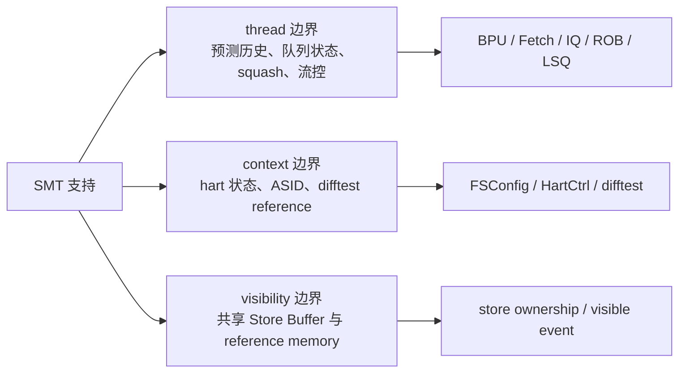
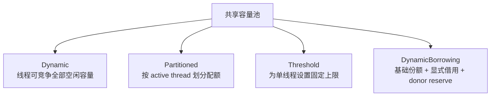
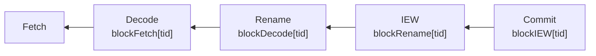
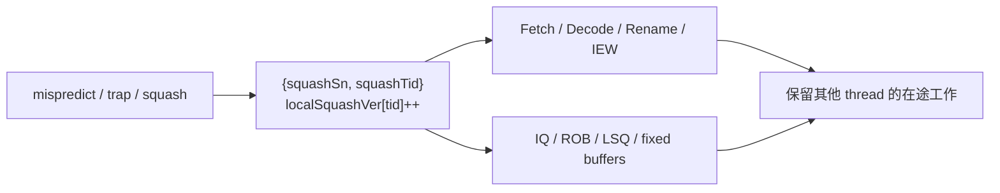
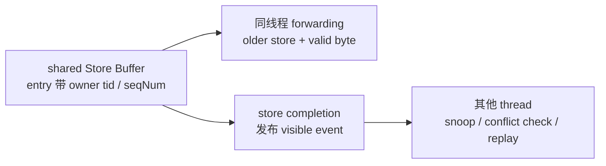

# XS-GEM5 SMT 设计说明

## 1. 文档范围

本文说明 XS-GEM5 从单线程默认实现演进到 FS-SMT 时，CPU 内部和系统验证路径需要建立的关键边界。

重点回答以下问题：

- 哪些状态必须按 hardware thread 隔离
- 哪些资源可以共享，以及共享容量如何分配
- 前后端如何按线程传播压力和恢复信息
- 共享 Store Buffer 如何表达跨线程可见性
- FS-SMT 如何启动 secondary hart 并完成多 context difftest

本文描述当前实现中的设计关系，不逐函数翻译源码。源码是行为的最终依据，文末给出稳定的文件和符号入口。

## 2. 总体设计：三类边界

SMT 不是简单地把 `numThreads` 从 `1` 改成 `2`。单线程实现中隐含的全局状态，需要重新判断它属于 thread、architectural context，还是共享结构中的 visibility。

三类边界分别解决不同问题：

| 边界 | 需要区分的对象 | 主要风险 |
| --- | --- | --- |
| `thread` | 同一 core 内的 hardware thread | 一个线程的预测历史、阻塞或恢复误伤另一个线程 |
| `context` | architectural hart 和地址空间 | hart 状态或 reference context 错配 |
| `visibility` | 共享存储结构中的数据版本 | 数据已存在，但尚不应被另一个线程观察到 |

核心原则是：共享物理结构不等于共享全部状态。容量可以共享，但 ownership、ordering、recovery 和 visibility 仍需携带线程或 context 身份。

## 3. 资源共享模型

SMT 配置需要分成三层理解。混淆这三层，容易把容量策略误认为周期级调度算法。

| 层次 | 回答的问题 | 当前接口示例 |
| --- | --- | --- |
| Mode | 物理结构独立还是共享 | LSQ / FTQ 的 `Independent`、`Shared` |
| Capacity policy | 共享容量如何对线程可见 | `Dynamic`、`Partitioned`、`Threshold`、ROB 的 `DynamicBorrowing` |
| Scheduling policy | 本周期让哪个线程使用带宽 | Fetch、Commit 以及各 stage 的 thread arbiter |

### 3.1 Independent 与 Shared

`Independent` 为每个线程提供独立的逻辑资源。配置的 entry 数量按线程解释，隔离直接，但总容量会随线程数增长。

`Shared` 把配置的 entry 数量解释为 core 内线程竞争的总池。它提高空闲容量利用率，但必须定义每个线程的 logical maximum、logical free entries 和准入规则。

LSQ 与 FTQ 都显式提供 Mode。ROB 和 IQ 本身按线程记录内容，并通过 policy 控制共享物理容量的可用份额。

### 3.2 容量策略

- `Dynamic` 允许线程使用共享池中的可用容量，利用率最高，但隔离最弱。
- `Partitioned` 按 active thread 划分配额，隔离稳定，但可能留下无法借用的空闲容量。
- `Threshold` 为线程设置固定上限；logical allocation 会取 threshold 与共享总容量的较小值。
- `DynamicBorrowing` 当前由 ROB 使用。线程从基础份额开始，可借用其他线程暂时不用的容量，但为被识别为 donor 的线程保留恢复配额。

`DynamicBorrowing` 不是“本周期选哪个线程”的调度器。它只回答某个线程还能否向 ROB 分配 entry。

当后端压力表明某线程暂时无法提供新指令时，该线程可被标记为 donor。借用者可以越过自己的基础份额，但不能占掉 donor 恢复所需的保留 entry。

### 3.3 当前 SMT 示例配置

`configs/example/smt_idealkmhv3.py` 使用混合策略，而不是一套全局策略：

| 资源 | 当前设置 | 设计倾向 |
| --- | --- | --- |
| FTQ | `Shared + Partitioned` | 共享物理容量，同时避免一个线程占满前端入口 |
| IQ | 默认 `Partitioned` | 优先保证执行入口隔离 |
| ROB | `DynamicBorrowing` | 在隔离和空闲容量复用之间折中 |
| LSQ | `Shared + Dynamic` | 优先提高昂贵访存队列的利用率 |
| Fetch / Commit | 默认 `RoundRobin` | 周期级带宽仲裁与容量策略分开配置 |

该组合不是通用最优解。它表达的是当前模型的取舍：前端和 IQ 更强调隔离，ROB 允许受控借用，LSQ 更强调动态利用率。

## 4. 分支预测与前端命名空间

FS-SMT 中，不同线程可能运行在相同或不同地址空间。PC 本身不足以同时表达 control-flow history 和地址空间身份。

预测路径因此采用两层区分：

1. `BTBTAGE`、`ITTAGE`、`MicroTAGE`、`MGSC` 和 `RAS` 等历史或状态按 `tid` 保存。
2. BTB/TAGE 类结构的 tag 或 index 注入从 `satp` 提取并折叠得到的 ASID hash。

per-thread history 避免两个线程互相改写控制流上下文。ASID hash 用于降低不同地址空间中相同 PC 的结构 alias，但 hash 不是完整 ASID，不能把它理解为绝对隔离。

预测结果、FTQ entry 和训练 stream 都继续携带 `tid` 与 `asidHash`。这样 lookup、发布和 update 使用同一命名上下文。

关键不变量：

- history 的 owner 是 thread
- BTB 命名空间至少包含 PC 和折叠后的地址空间信息
- prediction、resolve 和 update 不能在传播中丢失 `tid` 或 `asidHash`

主要代码入口：

- `src/cpu/pred/btb/decoupled_bpred.cc`：提取 ASID hash，并把它放入预测与训练路径
- `src/cpu/pred/btb/common.hh`：ASID hash folding、tag injection 和 index xor
- `src/cpu/pred/btb/btb_tage.cc`、`btb_ittage.cc`、`microtage.cc`、`btb_mgsc.cc`：per-thread state 与 ASID-aware lookup/update
- `src/cpu/pred/btb/ras.cc`：per-thread RAS 状态

## 5. Fetch：线程本地状态与压力反馈

Fetch 需要同时解决 correctness 和 bandwidth allocation。前者要求 FTQ head、fetch target、resolve update 和 squash version 按线程维护；后者需要知道哪个线程更值得继续取指。

IEW 按 `tid` 回传 IQ、LSQ 和 ROB 占用/阻塞信息。Fetch 的仲裁器在候选线程之间选择，同时对后端长期阻塞或处于 ROB borrowing donor 状态的线程进行短期 throttle。

这种反馈的目标不是预测哪个线程“更快”，而是避免继续向已经受压的线程注入工作，让另一个可前进线程回收取指带宽。

关键不变量：

- 一个线程的 FTQ、fetch queue 或 squash 状态不能阻塞另一个可运行线程
- 后端计数必须带 `tid`，否则反馈会把总压力错误归因给单个线程
- throttle 是临时仲裁状态，不应改变 architectural thread 的 active 状态

主要代码入口：

- `src/cpu/o3/comm.hh`：IEW 到 Fetch 的 per-thread communication fields
- `src/cpu/o3/iew.cc`：按线程产生队列占用和 stall feedback
- `src/cpu/o3/fetch.cc`：`selectUnstalledThread()` 与 thread-local fetch/squash 状态
- `src/cpu/pred/btb/decoupled_bpred.cc`：FTQ Mode、policy 与 logical entry accounting

## 6. 流水线推进与 per-thread backpressure

O3 core 每周期按 `Commit -> IEW -> Rename -> Decode -> Fetch` 的顺序调用各级 `tick()`，最后统一 advance time buffers。

后级先计算资源释放、squash 和 block 状态，前级可在同周期消费更新后的 backpressure。各级先把输入搬入 stage-local fixed buffer，再决定本周期接收哪个线程的工作。

统一的 `StallSignals` 为每个 stage 边界保存 `MaxThreads` 维度的 block bit 和 reason：

这里的设计重点是“后向压力按线程传播”。共享 stage 可以只选择一个线程使用本周期带宽，但不能因为线程 A 的 ROB 满而无条件停止线程 B。

主要代码入口：

- `src/cpu/o3/cpu.cc`：reverse ordered tick、time-buffer advance 和共享 `StallSignals` 接线
- `src/cpu/o3/comm.hh`：`StallSignals`
- `src/cpu/o3/decode.cc`、`rename.cc`、`iew.cc`、`commit.cc`：各级 `moveInstsToBuffer()` 与 thread arbiter

## 7. IQ、ROB 与 Commit

### 7.1 Issue Queue

IQ 可以共享物理调度结构，但 producer lookup、依赖唤醒、commit cleanup 和 squash recycle 必须限制在当前 thread。

物理寄存器索引不能单独作为跨线程依赖的依据。`getInstByDstReg()` 同时接收 `tid` 和 consumer sequence boundary，wakeup 也检查 producer 与 consumer 的 `threadNumber`。

commit 和 squash 清理同样携带 `tid`。否则一个线程的 sequence number 边界可能回收另一个线程的 entry。

### 7.2 ROB 与 Commit

ROB 按线程维护 instruction list 和 group。Commit 为 active thread 分别计算 local commit window，再按线程遍历这些窗口推进退休。

ROB 准入使用当前线程的 logical limit。`DynamicBorrowing` 下还要检查 core 总容量、其他线程实际占用和 donor reserve。

Commit 产生的 `blockIEW[tid]`、完成序号和 ROB head 信息都按线程返回。某线程处于 `ROBSquashing`、`TrapPending` 或容量不足时，不应天然冻结另一个线程。

主要代码入口：

- `src/cpu/o3/issue_queue.cc`：thread-qualified lookup、wakeup、commit 和 squash
- `src/cpu/o3/rob.cc`：per-thread ROB list、capacity policy、`borrowingLimit()` 与 `canAllocate()`
- `src/cpu/o3/commit.cc`：local commit window、fixed buffer、ROB admission 与 per-thread backpressure

## 8. 恢复路径

单线程实现中只有 sequence number 的 squash 描述，在 SMT 下不完整。不同线程的 sequence number 不能组成一个全局恢复边界。

当前 `SquashInfo` 同时携带 `{squashSn, squashTid}`。Commit 还为每个线程维护 `localSquashVer`，在恢复时推进版本并向前级传播。

Fetch、Decode、Rename 和 IEW 只丢弃版本落后且属于目标线程的指令。IQ、LSQ、dispatch queue 和 stage-local fixed buffer 也只回收 `squashTid` 的状态。

恢复路径的不变量是：序号边界、线程边界和版本边界必须一起传播。任何一个缺失，都可能留下 stale work 或误杀其他线程。

主要代码入口：

- `src/cpu/o3/comm.hh`：`SquashInfo` 与 `SquashVersion`
- `src/cpu/o3/commit.cc`：`squashInflightAndUpdateVersion()`
- `src/cpu/o3/fetch.cc`、`decode.cc`、`rename.cc`、`iew.cc`：版本检查和 thread-local cleanup
- `src/cpu/o3/issue_queue.cc`、`lsq.cc`、`lsq_unit.cc`：共享结构中的 thread-qualified recovery

## 9. LSQ 与共享 Store Buffer

LSQ 的 SMT 设计包含两个不同层面：queue capacity 与 memory visibility。前者决定能否分配 entry，后者决定一个线程何时能观察另一个线程的 store。

### 9.1 Queue capacity

LQ、SQ、RARQ 和 RAWQ 在 `Shared` 模式下使用 core-wide 总容量，并通过 `logicalMax*Entries()` 和 `logicalFree*Entries()` 对每个线程暴露可分配容量。

所有准入、full 判断和 backpressure 都必须使用 logical capacity。只检查某个 thread-local container 的物理大小，会绕过共享池的总量约束。

### 9.2 Store visibility

共享 Store Buffer 中的 entry 带有 owner `tid` 和 store sequence number。物理 buffer 可以共享，但 forwarding 不跨线程发生。

load 只查找 `load_tid` 对应的 entry，并且只消费比当前 load 更老、valid mask 覆盖目标 byte 的 store。这样，另一个线程已写入 buffer 的数据不会被当作本线程尚未建立顺序关系的 forwarding source。

store 达到完成/可见点后，`notifyOtherThreadsStoreVisible()` 向其他线程发送可见事件。接收线程检查同一地址的本地 load，按需要触发 replay，并同步处理 reservation snoop。

request lifetime 也必须与 entry lifetime 分开。replay、cancel、squash 和 destruct 路径要断开 stale request，防止旧回调重新作用于已经复用的 LSQ entry。

主要代码入口：

- `src/cpu/o3/lsq.hh`、`lsq.cc`：共享模式、logical capacity、Store Buffer ownership、forwarding 与 visibility notification
- `src/cpu/o3/lsq_unit.hh`、`lsq_unit.cc`：per-thread LQ/SQ、forwarding、store-visible handling 与 request lifetime
- `src/cpu/o3/BaseO3CPU.py`：LSQ Mode、policy 与 threshold 参数

## 10. FS-SMT 与多 context difftest

CPU 内部支持多线程后，full-system 还需要暴露对应数量的 architectural context，并能启动 secondary hart。

`configs/common/xiangshan.py` 根据 CPU 数和 SMT 开关计算 `num_threads`。`FSConfig.py` 把它传给中断控制器和 `HartCtrl`；`HartCtrl` 提供 secondary hart 的 release/wake 入口。

difftest 侧为每个 `tid` 分配独立 hart id 和 reference context。多 context 模式下，各 reference context 共享 golden memory 视图，以匹配真实系统中的共享物理内存。

gem5 与 reference 的 store 可见时点可能存在短窗口差异。实现保留 per-thread recent committed store snapshot，在 load/AMO 对账时区分真实错误与尚未进入共享 golden memory 的近期 store。

这些补偿只用于解释 reference timing window，不能替代 CPU 内部正确的 memory ordering 和 visibility 模型。

主要代码入口：

- `configs/common/xiangshan.py`、`configs/common/FSConfig.py`：系统 thread 数与设备配置
- `src/dev/riscv/hart_ctrl.cc`：secondary hart release/wake
- `src/cpu/base.cc`：per-thread difftest state、hart id、golden memory 和 recent committed stores
- `src/sim/system.hh`：`multiContextDifftest()` 与 golden memory manager

## 11. 设计不变量与已知取舍

实现和评审 SMT 变更时，应优先检查以下不变量：

1. 所有 recovery 边界都同时包含 thread 身份和 sequence/version 边界。
2. 共享 queue 的准入同时满足 core-wide 总容量和 per-thread policy。
3. per-thread pressure 只阻塞目标线程，除非真实共享带宽已耗尽。
4. predictor lookup 与 update 使用一致的 `tid` 和地址空间命名信息。
5. Store Buffer 的物理共享不扩大 forwarding 范围；跨线程可见性通过 completion event 和 replay 维护。
6. difftest 的兼容逻辑不掩盖模型内部的 ordering 或 visibility 错误。

当前设计仍包含明确取舍：

- ASID 使用折叠 hash，降低 alias 而非完全消除 alias。
- Dynamic 策略提高利用率，但可能增加线程间干扰。
- Partitioned 策略改善隔离，但会留下暂时不可复用的容量。
- DynamicBorrowing 依赖 donor 判定和 hold/reserve 参数，公平性与利用率需要用统计数据验证。
- reverse ordered tick 和 stage-local buffer 改变同周期 backpressure 关系，新增 stage 行为时必须保持调用顺序假设。

## 12. 推荐代码阅读顺序

建议按以下顺序建立整体认识：

1. `configs/example/smt_idealkmhv3.py`：当前实验配置组合。
2. `src/cpu/o3/BaseO3CPU.py` 与 `src/cpu/pred/BranchPredictor.py`：配置参数和默认值。
3. `src/cpu/o3/cpu.cc` 与 `comm.hh`：tick 顺序、通信结构和 stall/squash 协议。
4. `src/cpu/o3/fetch.cc`、`iew.cc`、`commit.cc`：周期级线程仲裁和压力传播。
5. `src/cpu/o3/rob.cc`、`issue_queue.cc`：共享后端结构的 ownership 与容量规则。
6. `src/cpu/o3/lsq.cc`、`lsq_unit.cc`：容量、ordering、visibility 和 request lifetime。
7. `src/cpu/pred/btb/`：per-thread predictor state 与 ASID-aware 命名空间。
8. `configs/common/FSConfig.py`、`src/dev/riscv/hart_ctrl.cc`、`src/cpu/base.cc`：FS bring-up 与验证闭环。
