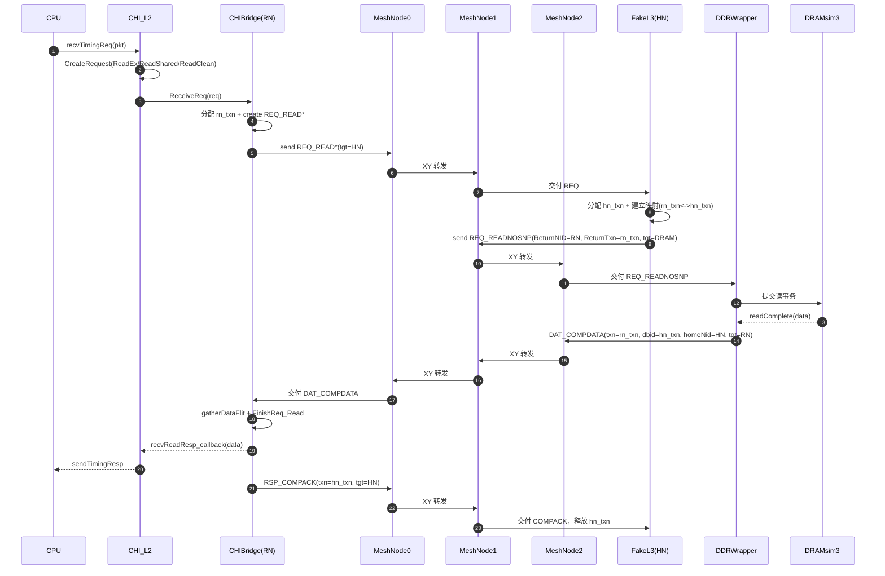
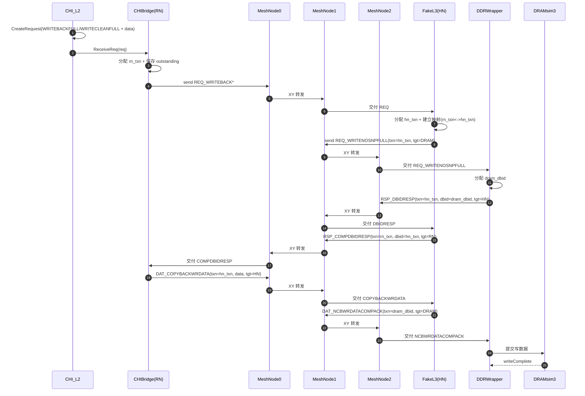

# xsCHI 模块代码结构说明

本文档总结 `src/mem/xsCHI` 下自定义 CHI 互连模型的主要组成、职责与数据流，便于快速定位代码与扩展。

## 摘要

| 维度 | 结论 |
|---|---|
| 当前拓扑 | 已采用 `2x2 MeshNode`：`RN@Mesh0.local0`、`HN@Mesh1.local0`、`DRAM@Mesh2.local0`，`Mesh3` 作为中转节点 |
| 数据流主线 | `CHI_L2(Packet)->Request -> CHIBridge(Req Flit) -> MeshNode(XY+VOQ+RR) -> FakeL3(HN 转换) -> DDRWrapper(DRAMsim3)`，返回路径反向 |
| 关键对象关系 | `SAM` 决定 `TgtId`；`TxnManager` 保证事务号生命周期；`Flit` 是链路传输单元；`Request` 是端点内部事务状态 |
| 功能边界 | `Snoop` 路径尚未实现（相关分支断言），读/写回主路径可运行 |

## 当前支持的 CHI 事务类型
- 读类：`READUNIQUE`、`READSHARED`、`READCLEAN`（由 CHI_L2 从 ReadEx/ReadShared/ReadClean/硬件预取映射）
- 写回类：`WRITEBACKFULL`、`WRITECLEANFULL`（L2 写回脏/干净）
- 维护类：`EVICT`、`CLEANUNIQUE`（UpgradeReq 映射到 CLEANUNIQUE）
- 转换/下行到 DRAM 时的内部 opcode：`READNOSNP`、`WRITENOSNPFULL`（由 FakeL3 通过单 `networkPort` 下发，目标由 `TgtId` 指向 DRAM 节点）、分离数据相关 `RESPSEPDATA`/`DATASEPRESP`、写回数据 `COPYBACKWRDATA`、数据完成 `COMPDATA`、确认 `COMP`、`COMPACK`、`COMPDBIDRESP`、`DBIDRESP`

## 事务与各组件处理逻辑
- **CHI_L2**
  - 将 gem5 `Packet` 映射为 `Request`：
    - `ReadEx/HardPF`→`READUNIQUE`；`ReadShared`→`READSHARED`；`ReadClean`→`READCLEAN`
    - `CleanEvict`→`EVICT`；`UpgradeReq`→`CLEANUNIQUE`
    - `WritebackDirty`→`WRITEBACKFULL`，`WritebackClean`→`WRITECLEANFULL`（复制数据载荷）
  - 调用 `CHIBridge::ReceiveReq` 发送到网络；记录需要响应的读请求以便回填 `Packet`。
  - 收到 `recvReadResp`（桥完成读）时，将数据拷回原 `Packet`、发送 timing 响应。

- **CHIBridge（RN 侧）**
  - 为入向请求分配 TxnID，生成 `Flit`（填充 `SrcId`、`TgtId` 来自 SAM），经 `CHIPort` 发送并挂起 outstanding。
  - 读路径：处理返回的 `DAT_COMPDATA` 或分离数据 `RESPSEPDATA`/`DATASEPRESP`，调用 `Request::gatherDataFlit` 聚合；数据与响应齐备后回调 CHI_L2、释放 TxnID，并向对端发送 `COMPACK`（使用 `Dbid`/`HomeNid` 信息）。
  - 写回路径：收到 `COMPDBIDRESP` 后按 `generateWriteDataID` 逐片发送 `DAT_COPYBACKWRDATA`，全部片段完成后释放 TxnID。
  - 驱逐：`EVICT` 仅等待 `COMP` 即完成；`CLEANUNIQUE` 收到 `COMP` 即完成（并可能触发 `COMPACK`）。
  - Snoop 未实现，相关分支断言。

- **FakeL3（简化 HN）**
  - 端口模型：单 `networkPort`。FakeL3 在同一入口按 `TgtId + Channel + Opcode` 判定“本地处理”或“下行/回程”路径，不再区分 `L2side/Dramside` 双端口。
  - 入向请求处理：
    - 读 `READUNIQUE/READSHARED/READCLEAN` 转换为 `READNOSNP` 下发 DRAM（重新分配 HN 侧 TxnID，记录 ReturnNID/ReturnTxnid）。
    - 写回 `WRITEBACKFULL/WRITECLEANFULL` 转换为 `WRITENOSNPFULL` 下发 DRAM，并保存源 `txn/source/target` 映射。
    - `EVICT` 直接回 `COMP`；`CLEANUNIQUE` 生成 `COMP`（带新 Dbid）并等待后续 `COMPACK` 收敛。
  - 回程/写数据处理：
    - 对写回，收到 `DBIDRESP` 后转为 `COMPDBIDRESP` 回 RN；随后接收 RN 的 `COPYBACKWRDATA`，转封为 `NCBWRDATACOMPACK` 下发 DRAM，全部分片完成后释放 txn。
    - 读数据 `DAT_COMPDATA` 的回程目标由 `TgtId` 指定并在同一端口发送。

- **DDRWrapper（存储端）**
  - 接收来自 FakeL3 的 `READNOSNP`/`WRITENOSNPFULL` 等 flit，转换为 DRAMsim3 事务，维护 outstanding 表。
  - 读完成：将 DRAM 返回数据封装为 `CHI_DAT_COMPDATA`（携带原 ReturnNID/Txnid、HomeNid/Dbid），按 `DATA_TRANSFER_WIDTH` 分片发送；全部分片发送后清理 outstanding。
  - 写路径：在 `WRITENOSNPFULL` 进入时调用 `accessAndRespond`，当写完成后返回 `DBIDRESP` 给 FakeL3；写数据分片由 FakeL3 通过 `NCBWRDATACOMPACK` 下发，Wrapper 不再拆分。
  - 依赖 `TxnIDManager` 跟踪本端事务，`responseQueue` 按 tick 发送。

## 目录分层
- **base/**：协议基础类型与通用设施。
  - [base/FlitOpType.hh](base/FlitOpType.hh)：CHI 四条通道的全部 opcode 枚举与字符串转换。
  - [base/flit.hh](base/flit.hh) & [base/flit.cc](base/flit.cc)：`Flit` 数据单元，封装路由/事务字段、数据载荷管理、通道类型判断、拷贝/构造与数据拷贝接口。
  - [base/request.hh](base/request.hh) & [base/request.cc](base/request.cc)：`Request` 事务对象，携带 CHI 头字段、数据缓冲与传输状态位图，支持数据收集 (`gatherDataFlit`)、写数据分片 ID 分配、读响应克隆。
  - [base/CHIPort.hh](base/CHIPort.hh) & [base/CHIPort.cc](base/CHIPort.cc)：带信用与多通道缓冲的时钟化端口，负责发送信用检查、接收排队、逐通道回调处理及信用返还，内部按 SNP→RSP→DAT→REQ 优先级轮询。
  - [base/Network/NodeID.hh](base/Network/NodeID.hh)：网格坐标到 NodeID 的编码/解码（X/Y/Port → 3 位后缀）。
  - [base/Network/SystemAddressMap.hh](base/Network/SystemAddressMap.hh)：RN/HN 的地址映射，采用基于物理地址位的幂次 hashing 生成目标节点。
  - [base/Network/TxnManager.hh](base/Network/TxnManager.hh)：12-bit 事务 ID 分配器，支持占用检查与释放。
  - [base/params.hh](base/params.hh)：协议常量（数据宽度、缓冲规模等）。
- **device/**：具体设备/适配器。
  - [device/CHI_L2.hh](device/CHI_L2.hh) & [device/CHI_L2.cc](device/CHI_L2.cc)：Gem5 L2 与 CHI 的双向适配。CPU 侧 `CpuSidePort` 接收普通缓存请求，转为 `Request` 后交给 `CHIBridge`；未缓存请求透传到 mem 侧。收到桥返回的读响应后回填原始 `Packet` 并送回 CPU。
  - [device/CHIBridge.hh](device/CHIBridge.hh) & [device/CHIBridge.cc](device/CHIBridge.cc)：RN 侧桥。为请求分配 TxnID、生成 `Flit`、通过 `CHIPort` 发送，跟踪未完成事务；处理返回的 RSP/DAT，组装读数据、发送 CompAck，写回路径生成数据 flit；当前未实现 snoop。
  - [device/FakeL3.hh](device/FakeL3.hh) & [device/fakeL3.cc](device/fakeL3.cc)：简化的 HN/Fake L3。采用单 `networkPort` 收发 flit；对读/写/驱逐请求执行无 snoop 转换并维护 txn 映射；对回程数据/响应执行回送与写数据下行驱动。
  - [device/DDRWrapper.hh](device/DDRWrapper.hh) & [device/DDRWrapper.cc](device/DDRWrapper.cc)：基于 `AbstractMemory` + DRAMsim3 的存储端。接收 `Flit`，将读写排队到 DRAMsim3，完成后按 CHI 数据 flit 回传，并维护 outstanding 读/写队列与响应优先队列。
  - [device/MeshNode.hh](device/MeshNode.hh) & [device/MeshNode.cc](device/MeshNode.cc)：已实现 mesh 路由节点，包含 `XY` 路由、`VOQ` 回压与按 `(egress, channel)` 维度的 `RR` 仲裁。
  - 其他：`fakeL3.hh` 为 FakeL3 声明头，当前以 `FakeL3` 作为简化 HN 行为实现。
- **TopoSys/**：组合系统。
  - [TopoSys/L2todram.hh](TopoSys/L2todram.hh) & [TopoSys/L2todram.cc](TopoSys/L2todram.cc)：构建 L2→FakeL3→DDR 的最小系统，分配节点 ID，配置 SAM，并连接各 `CHIPort`。
- **test/**：gtest 单元测试。
  - [test/testNodeID.cc](test/testNodeID.cc)、[test/testSAM.cc](test/testSAM.cc)、[test/testTxnManager.cc](test/testTxnManager.cc) 覆盖 NodeID 编解码、SAM 目标选择与 TxnID 分配。

## 关键类与数据流
- **Flit / Request 生命周期**：
  - CHI_L2 将 `Packet` 映射为 `Request`（读/写/驱逐/Upgrade 等），必要时复制数据载荷。
  - CHIBridge 为请求分配 TxnID、填充路由字段并封装为 `Flit`，通过 `CHIPort::send` 执行信用检查后发送。
  - FakeL3 / DDRWrapper 接收 flit 后，根据 `TgtId` 与通道/opcode 决定转发或落盘；FakeL3 通过单 `networkPort` 完成请求转换、回程映射与写数据下行。
  - 完成条件：读需收齐 DATA + RSP（或 RespSepData），写需获得 CompDBIDResp 并发送全部写数据分片；完成后释放 TxnID 并从 outstanding 表删除。

- **端口与流控（CHIPort）**：
  - 四通道独立信用计数与上次发送周期，防止同周期二次发送。
  - 接收侧缓冲大小由参数 `recv_buffer_size` 控制，按通道优先级调度并在回调成功后返还信用。
  - `setReceiveCallback` 由拥有者（桥/缓存/DRAM）注册，实现协议处理入口。

- **地址与节点标识**：
  - NodeID 将 (X,Y,Port) 编成 3-bit 后缀，便于网格路由。
  - SystemAddressMap* 根据物理地址位 XOR 生成 HN 选择下标，支持 2 的幂数量的目标节点；RN/HN 版本逻辑相同，主要用于读写分发。

- **事务管理**：
  - TxnIDManager 维护 12-bit ID 的使用位图，保证并发事务上限可配置；CHIBridge/FakeL3/DDRWrapper 分别持有自己的实例。
  - Request 内部 `dataFlitsTransferred` 位图确保分片接收/发送计数准确，防止重复。

## SAM / TxnManager / Flit / Request 四件套关系

| 对象 | 本质 | 链路职责 | 主要实现位置 |
|---|---|---|---|
| `SystemAddressMapRN/HN` | 地址到目标 NodeID 的映射器 | 决定 flit 的 `TgtId`（下一跳语义） | `base/Network/SystemAddressMap.hh` |
| `TxnIDManager` | 12-bit 事务号分配器 | 在“本节点发起事务”时分配/释放 txn_id | `base/Network/TxnManager.hh` |
| `Flit` | 网络传输单元 | 承载 `SrcId/TgtId/TxnId/Opcode/Data` 在 `CHIPort/MeshNode` 上流动 | `base/flit.hh`, `base/flit.cc` |
| `Request` | 端点内部事务状态 | 跟踪事务上下文、数据分片位图、回调完成条件 | `base/request.hh`, `base/request.cc` |

可将实现理解为两层模型：`Request` 是端点状态机对象，`Flit` 是链路传输对象，二者由 `CHIBridge/FakeL3/DDRWrapper` 做协议转换；`SAM` 负责“发给谁”，`TxnManager` 负责“这是谁的事务”。

## 数据路径概览（L2 → DRAM）
1. CPU 发起缓存请求，`CHI_L2::CpuSidePort::recvTimingReq` 转换为 `Request` 并调用 `CHIBridge::ReceiveReq`。
2. CHIBridge 分配 TxnID、创建 `Flit`，经 `CHIPort` 送往 FakeL3（HN）。
3. FakeL3 在单 `networkPort` 上将读/写请求转换为无 snoop 的 DRAM 请求，使用自身 TxnID 管理，并把原始源/txn 记录在 outstanding。
4. DDRWrapper 将 flit 转为 DRAMsim3 事务；读完成后构造 `CHI_DAT_COMPDATA`，写路径在收到写请求时会直接 `accessAndRespond`，完成后返回 `CHI_RSP_DBIDRESP`，随后 FakeL3 触发数据下行与 CompDBIDResp 上行。
5. 数据/响应沿原路返回；CHIBridge 组装读数据后调用回调 `recvReadResp`，由 CHI_L2 回填原 `Packet` 并送回 CPU。

## 显式经过 MeshNode 的时序图（单独段落）
说明：以下两张图采用显式 mesh 展开视图，统一以 `RN@Mesh0.local0 -> HN@Mesh1.local0 -> DRAM@Mesh2.local0` 展示每一跳转发路径，便于区分“协议端点交互”和“mesh 路由转发”。

### 时序图 1：读路径（RN→HN→DRAM + 回程闭环）

### 时序图 2：写回路径（RN→HN→DRAM）

## MeshNode 内部机制（ingress / egress / RR）

| 概念 | 在当前实现中的含义 | 关键点 |
|---|---|---|
| `ingress` | flit 进入 MeshNode 的入端口（`local0/local1/east/west/north/south`） | 每个物理端口注册统一回调，入口函数是 `handleIngress` |
| `egress` | 根据 `tgt_id` 计算得到的出端口 | `routeFor` 采用确定性 `XY`（先 X 后 Y） |
| VOQ 组织 | `outVoq[egress][channel][ingress]` | 避免不同 egress 之间的 HOL 阻塞 |
| 回压点 | 若 `(egress, channel)` 总深度达到 `voq_depth` | `handleIngress` 返回 `false`，上游 `CHIPort` 保留 flit 不弹出 |
| 调度节拍 | `sendEvent` 每周期扫描所有 egress | 每个 egress 独立仲裁，失败会在后续周期重试 |
| 通道顺序 | `SNP > RSP > DAT > REQ` | 与 `CHIPort` 接收处理顺序对齐 |
| RR 粒度 | 每个 `(egress, channel)` 独立 `cursor` | 在 6 个 ingress 上轮询选源 |
| RR 推进 | 仅发送成功后推进 `cursor` | 若下游 `send` 失败，保持当前位置，下一周期继续尝试 |

## 当前缺口与扩展点
- Snoop 请求/响应未实现，`CHIBridge::handleNetworkPortReceive` 和 `FakeL3` 中相关分支直接断言。
- 信用/仲裁策略简单，暂未建模网络延迟与多节点拓扑，仅在 `CHIPort` 内做基本周期调度。
- 当前错误处理以 `assert/panic` 为主，可恢复路径较弱；后续可增加统计、降级与 retry 策略。

## 验证与阅读顺序

| 步骤 | 建议入口 | 目的 |
|---|---|---|
| 1 | `TopoSys/L2todram.cc` | 固定 2x2 拓扑与端点放置（RN/HN/DRAM） |
| 2 | `base/Network/NodeID.hh` + `base/Network/SystemAddressMap.hh` | 理解 NodeID 编码和地址到目标节点映射 |
| 3 | `base/CHIPort.cc` | 理解信用、通道优先级、回压传播 |
| 4 | `device/MeshNode.hh/.cc` | 吃透 ingress->egress->VOQ->RR 的路由与仲裁 |
| 5 | `device/CHIBridge.cc` + `device/fakeL3.cc` + `device/DDRWrapper.cc` | 串起读/写回协议转换闭环 |

## 风险与改进建议

| 类型 | 当前风险 | 建议 |
|---|---|---|
| 协议覆盖 | `Snoop` 分支未实现 | 优先补 `CHIBridge/FakeL3` snoop 处理与测试 |
| 并发语义 | `CHI_L2` outstanding 以地址为 key，限制同地址并发请求 | 后续改为 txn-key 或 `(addr, txn)` 复合 key |
| 仲裁公平性 | 通道固定优先级在高压下可能压制低优先通道 | 引入 aging 或加权 RR |
| 鲁棒性 | 多处 `assert/panic`，故障恢复能力弱 | 对可恢复错误补状态机回退与统计观测 |

## 使用提示
- 需要最小可运行链路时，可使用 [TopoSys/L2todram.cc](TopoSys/L2todram.cc) 直接连接 CHI_L2、FakeL3、DDRWrapper 并配置 SAM/NodeID。
- 添加新 opcode 或通道行为时，先更新 [base/FlitOpType.hh](base/FlitOpType.hh)，再在相关处理函数中补齐分支（CHI_L2 → CHIBridge → FakeL3/DDRWrapper）。
- 调试链路时可启用 `debug/CHIPort`, `debug/CHIBridge`, `debug/CHIL2Wrapper`, `debug/CHIFakeL3`, `debug/CHIDramsim` 等 trace 标志观察 flit 发送/信用状态。
