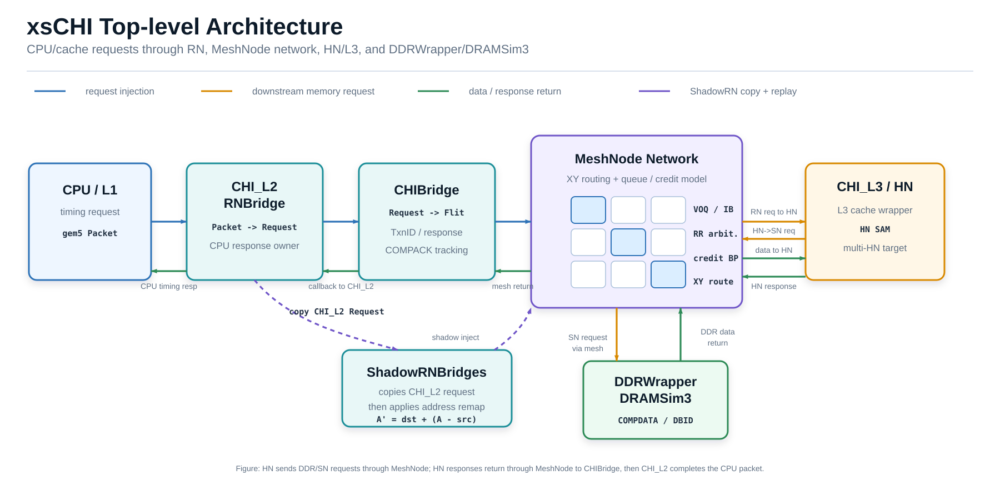
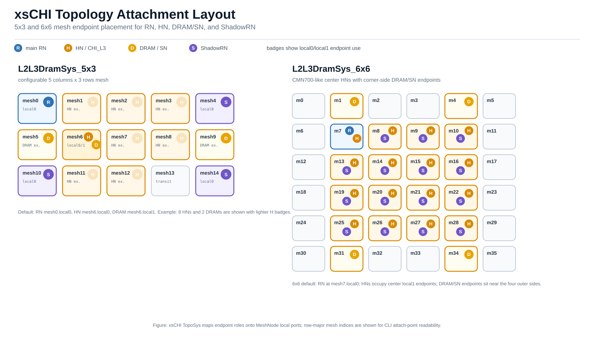
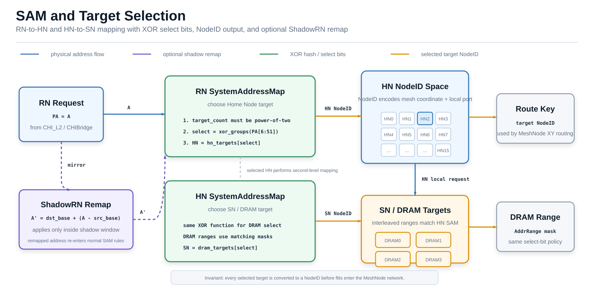
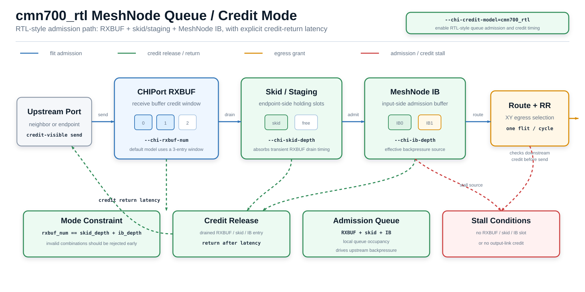

# xsCHI Architecture Overview

本文档是 xsCHI 当前实现的架构入口。它面向需要在 GitHub 上快速理解代码结构、
拓扑配置、数据通路和诊断入口的读者：先给出整体设计视图，再按模块索引到更细的
design doc。



## Quick Navigation

下面索引到的模块详细文档统一放在 `indexed/` 子目录中；`report/` 根目录保留总览、
历史记录、实验报告和临时分析文档。

| 主题 | 入口 |
|---|---|
| SAM / 地址映射规则 | [SAM Rules](indexed/SAM-rules-explain.md) |
| 多 HN / 多 DRAM 映射 | [HN/DRAM Mapping](indexed/HN-DRAM-mapping-8hn-2dram.md) |
| TopoSys 配置与测试 | [TopoSys Config Guide](indexed/TopoSys_Multicore_Config_Test_Guide.md) |
| xsCHI 测试运行指南 | [xsCHI Test Run Guide](indexed/xsCHI-test-run-guide.md) |
| MeshNode 设计 | [MeshNode Design](indexed/Design_MeshNode.md) |
| CMN700 XP 对照 | [CMN700 XP](indexed/CMN700_XP.md) |
| cmn700_rtl credit / queue | [cmn700_rtl Queue/Credit](indexed/cmn700_rtl_queue_credit_implementation.md) |
| cacheable path 与延迟拆分 | [Cache Path Config](indexed/20260601_xschi_cache_path_config_confirm.md) |
| credit stall / load latency | [Credit Stall Latency](indexed/cmn700_rtl_credit_stall_load_latency.md) |
| MeshNode performance counters | [MeshNode PC/DV](indexed/MeshNode-pc-dv.md) |

## Overview

xsCHI 在 gem5 中提供一套 CHI-style memory system 建模路径。它把上层 cache
请求转换为 xsCHI `Request` 和 CHI-like `Flit`，通过 MeshNode 组成的片上网络
完成 RN/HN/SN 之间的路由、仲裁和 backpressure 建模，并在 SN 侧连接
DDRWrapper/DRAMSim3。

当前实现的重点不只是功能连通，还包括可配置拓扑、多 HN/DRAM 地址映射、
CMN700-like queue/credit 行为、ShadowRN replay，以及围绕 MeshNode 和 credit
stall 的统计诊断能力。文档组织上，总览只解释模块关系和数据流，具体规则保留在
各模块 detail doc 中维护。

## Top-level Architecture

当前主线数据通路可以概括为：

```text
CPU / L1
  -> CHI_L2 / RNBridge
  -> CHIBridge
  -> MeshNode network
  -> CHI_L3 / HN
  -> DDRWrapper / DRAMSim3
```

| 层级 | 主要对象 | 职责 |
|---|---|---|
| CPU/cache side | `CHI_L2` | 接收上层 timing request，生成 xsCHI request，并维护原始 packet 的完成回调 |
| RN injection | `CHIBridge` | 把 `Request` 转成 CHI-like flit，分配/跟踪事务，处理 response 与 COMPACK |
| On-chip network | `MeshNode` + `CHIPort` | 负责 XY routing、VOQ/IB buffering、RR arbitration、credit/backpressure |
| HN/cache side | `CHI_L3` | 在当前多 HN 拓扑中承担 HN 角色，连接 L3 cache wrapper 和下游 SN path |
| Legacy HN | `FakeL3` | 早期/minimal path 使用的简化 HN，不代表当前多 HN 主路径 |
| SN/DRAM side | `DDRWrapper` | 把 CHI-like memory request 接入 DRAMSim3，并生成 data/dbid response |

## Supported Topologies

TopoSys 负责实例化 MeshNode grid，并把 RN/HN/DRAM endpoint 挂载到指定
`meshN.localX` 端口。当前总览把 5x3 和 6x6 作为主线拓扑介绍；3x3 与
legacy/minimal path 作为兼容和历史路径说明；6x4 当前不进入本次正式设计文档主线。



| 拓扑 | 当前定位 | 默认/典型挂载 |
|---|---|---|
| `L2ToDramSys` | legacy/minimal path，用于简单连通和早期验证 | RN、simplified HN/FakeL3、DRAM 组成的小规模路径 |
| `L2L3DramSys` / `L2L3DramSys3x3` | 中间形态，用于 2D mesh 和 L2/L3/DRAM path 验证 | 以单 RN、单/少量 HN、单 DRAM 为主 |
| `L2L3DramSys_5x3` | 当前重点拓扑之一，支持 configurable RN/HN/DRAM attach 和 ShadowRN | 默认 RN `mesh0.local0`，默认 HN `mesh6.local0`，默认 DRAM `mesh6.local1`，默认 shadow 起点包括 `mesh14.local0` |
| `L2L3DramSys_6x6` | 当前重点拓扑之一，面向 CMN700-like 多 HN / 多 SN 布局 | 默认 RN `mesh7.local0`，默认 16 个 HN 位于中心区域 `local1`，默认 4 个 DRAM/SN 位于四角附近 |

TopoSys 和 `configs/common/CacheConfig.py` 协同完成以下工作：

| 配置能力 | 行为 |
|---|---|
| RN attach | 通过 `--chi-rn-attach-point` 或拓扑默认值选择主 RN 注入点 |
| HN attach | 通过 `--chi-hn-count` 和 `--chi-hn-attach-points` 建立 HN 列表 |
| DRAM attach | 通过 `--chi-dram-count` 和 `--chi-dram-attach-points` 建立 SN/DRAM 列表 |
| L3 resource split | 多 HN 时按 HN 数量严格平分总 L3 size 和 MSHR，无法整分时直接报错 |
| DRAM ranges | 多 DRAM 时按 xsCHI SAM 同构 XOR mask 生成 interleaved ranges |
| ShadowRN | 可按拓扑默认 attach list 或 CLI 参数建立多个 shadow injection source |

详细配置和测试方式见 [TopoSys Config Guide](indexed/TopoSys_Multicore_Config_Test_Guide.md)。

## Address Mapping and Node Identity

xsCHI 使用 NodeID 标识 mesh endpoint，使用 SystemAddressMap 在 RN/HN/SN 之间选择目标。
这部分是多 HN、多 DRAM 和 ShadowRN 正确性的基础。



| 机制 | 当前实现要点 | 详细入口 |
|---|---|---|
| NodeID | NodeID 编码 mesh 坐标和 local endpoint，用于 flit routing 和 response target | `base/Network/NodeID.hh` |
| RN SAM | `SystemAddressMapRN` 根据地址选择 HN target，单 HN 时固定选择目标 | [SAM Rules](indexed/SAM-rules-explain.md) |
| HN SAM | `SystemAddressMapHN` 根据地址选择 DRAM/SN target，多 DRAM path 使用相同 XOR 规则生成 interleaved ranges | [HN/DRAM Mapping](indexed/HN-DRAM-mapping-8hn-2dram.md) |
| XOR hash | target 数量大于 1 时要求 power-of-two，通过 PA[6:51] 分组 XOR 生成 select bits | [SAM Rules](indexed/SAM-rules-explain.md) |
| Shadow remap | `CHI_L2` 按 `A' = dst_base + (A - src_base)` 对 shadow request 改写地址 | [SAM Rules](indexed/SAM-rules-explain.md) |

## RN-side Components

RN-side path 的职责是把 gem5 timing request 接入 xsCHI protocol path，同时维护 CPU
侧完成语义和可选 shadow replay。

| 模块 | 职责 | 输入 | 输出 |
|---|---|---|---|
| `CHI_L2` | 接收 CPU/cache side request，创建 xsCHI `Request`，维护原始 packet 映射和完成回调 | gem5 `Packet` | xsCHI `Request` |
| `CHIBridge` | 承担 RN bridge，给 request 分配/跟踪事务，把 request 转换为 request flit | xsCHI `Request` | CHI-like `Flit` |
| `ShadowRNBridges` | 可选 shadow 注入源，用于 mirror 主请求并按 shadow window 做地址重映射 | mirrored request | remapped shadow request/flit |

关键行为：

| 行为 | 说明 |
|---|---|
| Read request | `CHI_L2` 生成 read request，经 `CHIBridge` 注入 mesh，最终等待 data response 完成 CPU packet |
| Write request | write path 需要处理 DBID response、write data flit 和 completion/COMPACK 相关状态 |
| Shadow replay | 开启 `--shadow-l2-enable` 后，主请求可 mirror 到多个 shadow bridge；每个 shadow 有独立 attach point 和地址窗口 |
| Strict validation | shadow attach、src/window/dst 数量必须匹配，dst windows 会检查重叠 |

相关入口：

| 主题 | 链接 |
|---|---|
| cache wrapper / CHI bridge 设计 | [Design CacheWrapper CHI](indexed/Design_CacheWrapper_CHI.md) |
| shadow remap 与 SAM 关系 | [SAM Rules](indexed/SAM-rules-explain.md) |

## Protocol Data Model

xsCHI 的 protocol path 以 `Request`、`Flit` 和事务管理为中心。总览只列出它们的架构角色；
opcode、channel 和状态迁移细节应优先对照实现与后续专项文档。

| 对象 | 角色 |
|---|---|
| `Request` | RN/HN/SN 之间的高层请求描述，保留地址、类型、origin/target 等事务上下文 |
| `Flit` | 在 MeshNode 网络中传输的 CHI-like 单元，承载 opcode、channel、TxnID、source/target 等信息 |
| `TxnManager` | 管理 outstanding transaction，并把 response flit 与原始 request 关联起来 |
| `FlitOpType` | 定义 request/response/data/snoop 相关 opcode 枚举和分类辅助函数 |

实现入口：

| 文件 | 用途 |
|---|---|
| `base/request.hh` / `base/request.cc` | xsCHI request 数据结构 |
| `base/flit.hh` / `base/flit.cc` | CHI-like flit 数据结构 |
| `base/Network/TxnManager.hh` / `base/Network/TxnManager.cc` | 事务跟踪 |
| `base/FlitOpType.hh` / `base/FlitOpType.cc` | opcode/channel 分类 |

## HN-side Components

当前多 HN 主线使用 `CHI_L3` 作为 HN 侧对象。它连接 xsCHI network port 和内部
L3 cache wrapper / coherent xbar，把来自 RN 的 request 映射到 cache/下游 memory path，
再把 response 转回 CHI-like flit。

| 模块 | 定位 | 说明 |
|---|---|---|
| `CHI_L3` | 当前主线 HN | 面向多 HN 拓扑，配合 L3 resource split 和 HN SAM 使用 |
| `FakeL3` | legacy/minimal HN | 简化实现，主要用于早期 `L2ToDramSys` 等路径，不作为当前多 HN 主路径 |
| `L3CacheWrapper` | HN 内部 cache wrapper | 每个 HN 获取按 `hn_count` 平分后的 L3 capacity/MSHR 预算 |

与 cacheable path、HN local path 和延迟拆分相关的背景见
[Cache Path Config](indexed/20260601_xschi_cache_path_config_confirm.md)。

## SN / DRAM Path

SN/DRAM path 由 `DDRWrapper` 承担。它把 HN 侧送来的 CHI-like memory request 转换为
DRAMSim3 访问，并在 DRAM response 后生成相应 flit 返回 HN/RN path。

| 行为 | 说明 |
|---|---|
| Read | 接收 `READNOSNP` 类请求，送入 DRAMSim3，完成后返回 `COMPDATA` |
| Write | 接收 `WRITENOSNPFULL` / write data 相关 flit，维护 DBID/data/completion 语义 |
| Padding | `--chi-ddr-read-response-padding-cycles` 可给 read response 增加额外延迟，用于延迟对齐实验 |
| DRAM range | 多 DRAM path 的地址范围按 SAM XOR mask 建立 interleaved ranges |

多 DRAM path 的地址范围和 HN/SN target selection 规则见
[HN/DRAM Mapping](indexed/HN-DRAM-mapping-8hn-2dram.md)。

## MeshNode and Flow Control

MeshNode 是 xsCHI 片上网络的核心。每个 MeshNode 有坐标、local endpoint 和方向端口，
通过 XY routing 选择 egress，并使用 VOQ、IB、round-robin arbitration 和 credit model
表达拥塞与 backpressure。

| 结构 | 作用 |
|---|---|
| Direction ports | `local0` 必选，`local1/east/west/north/south` 可选 |
| XY routing | 根据目标 NodeID 的坐标选择东西/南北方向，再进入 local endpoint |
| VOQ | 按 egress/channel/ingress 或 egress/channel aggregate 统计深度，控制 backpressure |
| IB | cmn700_rtl-style ingress buffer，和 skid/RXBUF 一起形成更接近 RTL 的入口队列模型 |
| RR arbitration | 对可发送 flit 做 round-robin 选择，避免固定优先级导致长期饥饿 |
| CHIPort credit | 管理 receive buffer credit、credit release policy 和 return latency |

`cmn700_rtl` 模式下的入口 queue admission 和 credit timing 单独如下。该模式把
backpressure 绑定到 RXBUF、skid/staging 和 MeshNode IB，避免和普通 VOQ-depth
模型混用。



主要 CLI 配置：

| 参数 | 含义 |
|---|---|
| `--chi-credit-model` | 选择 `legacy`、`cmn700` 或 `cmn700_rtl` |
| `--chi-rxbuf-num` | CMN-style receive flit buffer entry 数量 |
| `--chi-skid-depth` | cmn700_rtl skid/staging entry 数量 |
| `--chi-ib-depth` | MeshNode ingress buffer 深度 |
| `--chi-initial-credit-count` | 初始可见 credit 数量 |
| `--chi-voq-depth` | MeshNode VOQ 深度阈值；`cmn700_rtl` 模式下不作为 admission gate 生效 |
| `--chi-voq-depth-mode` | 选择 per-ingress 或 aggregate VOQ 统计方式；`cmn700_rtl` 模式下不生效 |

在 `cmn700_rtl` 模式下，配置要求 `rxbuf_num == skid_depth + ib_depth`，
默认会以 3-entry RXBUF 和正数 skid/IB depth 建立 RTL-style queue path。
此时 `--chi-voq-depth` 和 `--chi-voq-depth-mode` 不会启用 VOQ-depth admission。

详细设计见 [MeshNode Design](indexed/Design_MeshNode.md)、
[CMN700 XP](indexed/CMN700_XP.md) 和
[cmn700_rtl Queue/Credit](indexed/cmn700_rtl_queue_credit_implementation.md)。

## Observability and Diagnosis

xsCHI 的诊断入口围绕三类信息组织：MeshNode routing/queue stats、protocol lifecycle stats、
以及 credit stall / load latency 分析。它们用于定位请求是否到达预期 HN/SN、是否在某个
port/queue 上 backpressure，以及延迟是否由 credit 或 DRAM response 组成。

| 诊断主题 | 入口 |
|---|---|
| MeshNode performance counters | [MeshNode PC/DV](indexed/MeshNode-pc-dv.md) |
| credit stall 与 load latency | [Credit Stall Latency](indexed/cmn700_rtl_credit_stall_load_latency.md) |
| cacheable path 延迟分解 | [Cache Path Config](indexed/20260601_xschi_cache_path_config_confirm.md) |
| cmn700_rtl queue/credit stats | [cmn700_rtl Queue/Credit](indexed/cmn700_rtl_queue_credit_implementation.md) |

## Detailed Design Index

| 模块 | 总览描述 | 详细文档 |
|---|---|---|
| SAM Rules | RN/HN target selection、shadow remap、XOR hash | [SAM Rules](indexed/SAM-rules-explain.md) |
| HN/DRAM Mapping | 多 HN、多 DRAM 的两级映射和 interleaved DRAM ranges | [HN/DRAM Mapping](indexed/HN-DRAM-mapping-8hn-2dram.md) |
| TopoSys Config | MeshNode grid 构建、RN/HN/DRAM attach point、shadow attach 配置 | [TopoSys Config Guide](indexed/TopoSys_Multicore_Config_Test_Guide.md) |
| xsCHI Test Run Guide | 构建、单点运行、批量运行、结果检查和基础单测 | [xsCHI Test Run Guide](indexed/xsCHI-test-run-guide.md) |
| MeshNode Design | XP-like MeshNode、XY routing、VOQ、IB、RR arbitration | [MeshNode Design](indexed/Design_MeshNode.md) |
| CMN700 XP | CMN700 XP queue-like 行为与 xsCHI 对应关系 | [CMN700 XP](indexed/CMN700_XP.md) |
| cmn700_rtl Credit | RXBUF、skid、IB、credit return、stall stats | [cmn700_rtl Queue/Credit](indexed/cmn700_rtl_queue_credit_implementation.md) |
| Cache Path Delay | cacheable path、L2Wrapper 到 CHI path、load latency 拆分 | [Cache Path Config](indexed/20260601_xschi_cache_path_config_confirm.md) |
| Credit Stall Latency | credit stall 对访存延迟的影响和诊断结论 | [Credit Stall Latency](indexed/cmn700_rtl_credit_stall_load_latency.md) |
| MeshNode Stats | performance counters、stats 字段、诊断 checklist | [MeshNode PC/DV](indexed/MeshNode-pc-dv.md) |

## Current Boundaries

| 边界 | 说明 |
|---|---|
| Snoop/coherency coverage | 本总览不把完整 CHI snoop/coherency 覆盖作为已完成能力；当前重点是 RN/HN/SN request/response path、routing、credit 和诊断 |
| FakeL3 | `FakeL3` 是 legacy/minimal path 的简化 HN，不应被当成当前多 HN cache path 的主实现 |
| 6x4 topology | 6x4 相关文件可能存在于工作区或实验分支，但本次 design doc 主线不把它列为正式拓扑 |
| 旧 README | `README.md` 中可能仍保留早期 2x2-only 描述；本文档作为当前架构阅读入口 |
| Error handling | 部分异常仍采用严格失败、assert 或 panic 风格，后续如需要可单独整理 recoverability 设计文档 |
